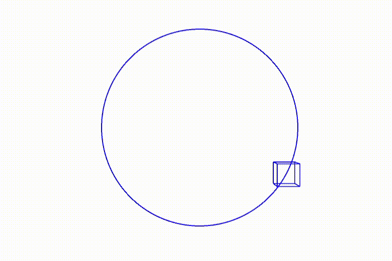
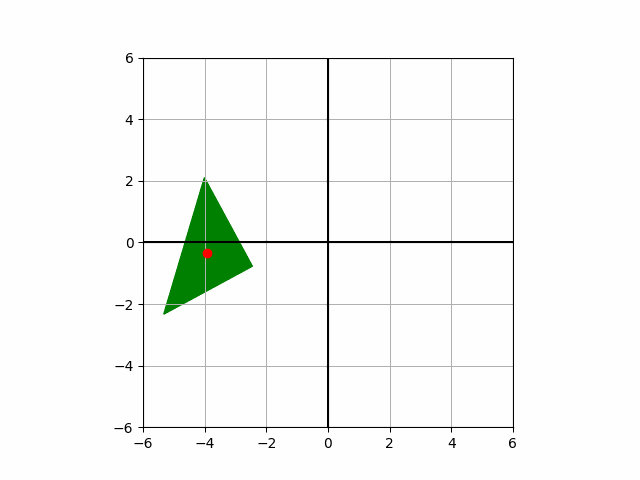
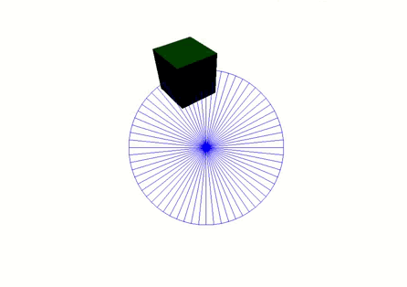

# Taller 1
## Introducción
Este taller explora transformaciones geométricas (traslación, rotación y escaka) en diferentes entornos de programación. En cada herramineta, se crea una escena básica con el objeto y se aplica sobre este las transfomaciones requeridas, dentro de un ciclo de animación.
A continuación se describe cada una de las implementaciones realizadas.

## Processing

[Enlace a la implementación en el repositorio](https://github.com/mijx/computacion-visual/tree/main/2025-04-09-taller1/processing/taller1)

Se plantea animar un cubo 3D que se traslada a lo largo de una trayectoria circular sobre el plano XY, con su movimiento determinado por las funciones trigonométricas cos() y sin(). Además, el cubo rota constantemente sobre su propio eje, con una rotación suave que se incrementa con cada cuadro. Finalmente, el tamaño del cubo varía dinámicamente a lo largo del tiempo, aplicando un escalado cíclico que oscila en función del tiempo transcurrido, logrando un efecto visual fluido y continuo.

La animación aprovecha las funciones de translate(), rotate() y scale() de Processing para aplicar estas transformaciones, y se utiliza pushMatrix() y popMatrix() para aislar y aplicar las transformaciones de manera independiente al cubo.

## Python

[Enlace a la implementación en el repositorio](https://github.com/mijx/computacion-visual/tree/main/2025-04-09-taller1/python)

En este caso se crea una animación en 2D de un triángulo que se desplaza a lo largo del eje X, rota sobre su centro de masa y aumenta su tamaño un 1.7% en cada cuadro de la animación. El centro de rotación se indica con un punto rojo que sigue el movimiento del centroide del triángulo a medida que este se traslada y rota.

La transformación del triángulo se realiza mediante el uso de matrices de rotación y escalado, y el cálculo del centroide permite realizar las transformaciones con respecto al centro de la figura. La animación se genera con FuncAnimation de matplotlib, y se exporta como un GIF animado.

## Three JS

[Enlace a la implementación en el repositorio](https://github.com/mijx/computacion-visual/tree/main/2025-04-09-taller1/threejs)

Finalmente, en la escena hecha en Three JS, se crea una animación 3D de un cubo que se traslada a lo largo de una trayectoria circular, rota sobre dos de sus ejes y cambia de tamaño de manera oscilante en función del tiempo (efecto de expansión y contracción). 

La escena está configurada con una cámara en perspectiva y un fondo blanco, mientras que una fuente de luz direccional ilumina el cubo, para facilitar la visualización del movimiento del cubo. Además, un círculo azul se dibuja alrededor del cubo para representar visualmente su trayectoria de traslación.