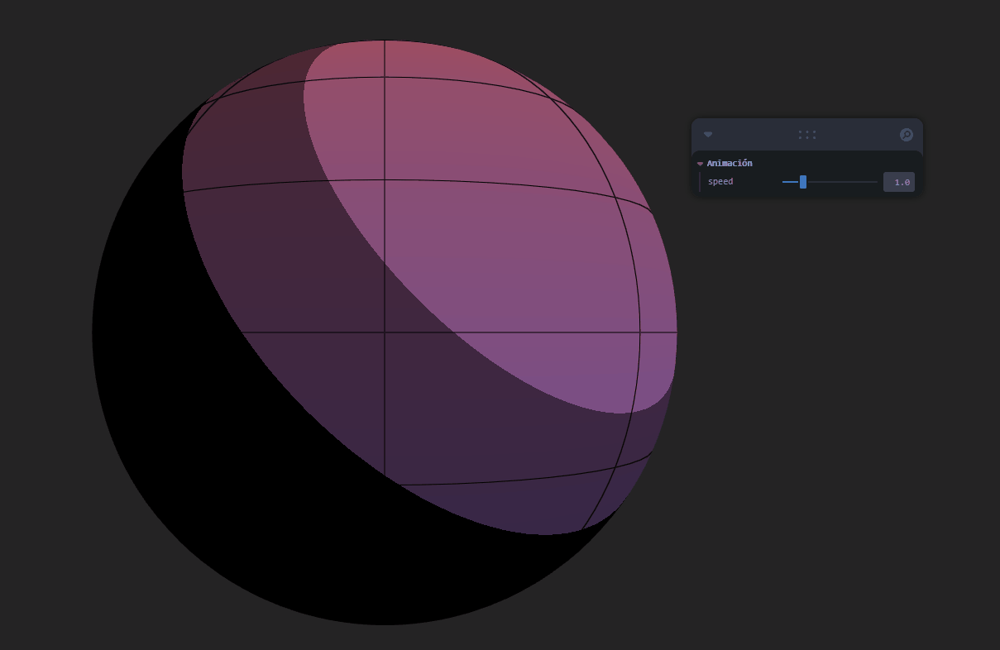

# 🧪 Taller - Sombras Personalizadas: Primeros Shaders en Unity y Three.js

## 🗓️ Fecha

2025-05-24

---

## 🎯 Objetivo del Taller

Introducir la creación de shaders personalizados para modificar visualmente materiales en tiempo real, comprendiendo la estructura básica de un shader y aplicando efectos visuales mediante código.

---

## 🧠 Conceptos Aprendidos

* Qué es un **shader**: pequeño programa que corre en la GPU para controlar el aspecto visual de los objetos.
* Vertex Shader: transforma posiciones y transmite información.
* Fragment Shader: calcula el color final de cada fragmento (píxel) del objeto.
* Uniforms: valores enviados desde el CPU al shader que pueden cambiar con el tiempo.
* Toon Shading, Gradientes y Contornos visuales.

---

## 🛠️ Herramientas y Entornos

* React Three Fiber (Three.js en React).
* Leva para controles interactivos.
* GLSL (Lenguaje para shaders).

---

## 📁 Estructura del Proyecto

```
2025-05-24_taller_shaders_basicos/
├── public/
│   └── index.html
├── src/
│   └── App.jsx
├── resultados/
│   └── gradiente_toon_wireframe.gif
└── README.md
```

---

## 💡 Implementación en React Three Fiber

### 🔹 Definición de ShaderMaterial

```jsx
const shaderMaterial = useMemo(
  () => new THREE.ShaderMaterial({
    uniforms,
    vertexShader,
    fragmentShader
  }), [uniforms, vertexShader, fragmentShader]
);
```

Se crea el material personalizado utilizando vertex y fragment shaders escritos en GLSL.

### 🔹 Vertex Shader

```glsl
varying vec3 vNormal;
varying vec2 vUv;
void main() {
  vNormal = normal;
  vUv = uv;
  gl_Position = projectionMatrix * modelViewMatrix * vec4(position, 1.0);
}
```

Transfiere las normales y coordenadas UV para ser usadas en el fragment shader.

### 🔹 Fragment Shader

```glsl
uniform float uTime;
uniform float uSpeed;
varying vec3 vNormal;
varying vec2 vUv;

void main() {
  vec3 gradColor = mix(vec3(0.0, 0.5, 1.0), vec3(1.0, 0.5, 0.0), vUv.y);
  float pulse = 0.5 + 0.5 * sin(uTime * uSpeed);
  vec3 pulseColor = mix(vec3(1.0), vec3(1.0, 0.0, 1.0), pulse);

  vec3 lightDir = normalize(vec3(1.0, 1.0, 1.0));
  float diff = max(dot(normalize(vNormal), lightDir), 0.0);
  float toon = floor(diff * 3.0) / 3.0;

  vec3 color = mix(gradColor, pulseColor, 0.5) * toon;

  vec2 grid = abs(fract(vUv * 8.0 - 0.5) - 0.5) / fwidth(vUv * 8.0);
  float line = min(grid.x, grid.y);
  float edge = 1.0 - min(line, 1.0);
  color = mix(color, vec3(0.0), edge);

  gl_FragColor = vec4(color, 1.0);
}
```

Contiene:

* Gradiente vertical (vUv.y).
* Animación de color pulsante con `sin(uTime * uSpeed)`.
* Toon shading con 3 niveles usando `floor()`.
* Efecto tipo wireframe en UVs.

### 🔹 Actualización del tiempo (uTime)

```jsx
useFrame((state, delta) => {
  uniforms.uTime.value += delta;
  meshRef.current.material.uniforms.uTime.value = uniforms.uTime.value;
});
```

Permite que el shader tenga una animación continua.

---

## 📊 Resultados Visuales

* Gradiente animado + Toon Shading + Wireframe UV:



---

## 🔎 Prompts Utilizados

* "crear shader personalizado con fragment y vertex shader en three.js"
* "GLSL ejemplo de toon shading"
* "usar gl\_FragCoord para wireframe o contorno"
* "como animar shader con uTime y uniformes"
* "generar gradiente vertical en fragment shader"
* "mezclar dos colores en shader con mix()"

---

## 💬 Reflexión Final

Este taller me ayudó a entender la estructura de un shader y cómo se conectan los datos del CPU con la GPU. Experimentar con `uniforms`, `mix`, `floor` y `fwidth` me permitió lograr efectos como toon shading y wireframe visual. El mayor reto fue modular el código para combinar distintos efectos sin perder rendimiento. Al cambiar pequeños valores en el shader, el resultado visual cambiaba radicalmente, lo que evidencia el poder y flexibilidad de estas técnicas visuales en tiempo real.

---
