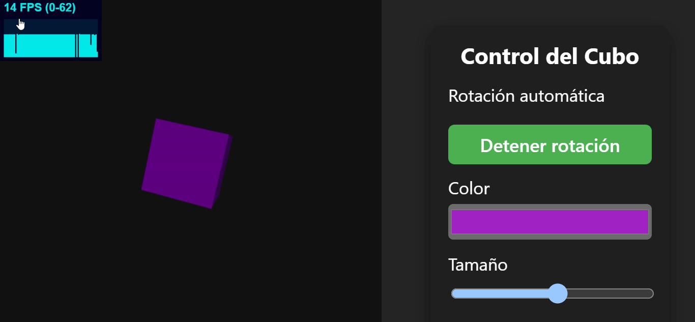

# 🎮 Taller 16 - Entrada del Usuario e Interfaz UI en Unity y Three.js

## 🎯 Objetivo del Taller

Aprender a capturar y procesar **entradas del usuario** (mouse, teclado, touch) e implementar interfaces visuales (UI) que permitan interacción dinámica en **Unity** y **Three.js con React**. Este taller es clave para desarrollar aplicaciones interactivas, videojuegos o experiencias XR.

---

## 🧠 Conceptos Aprendidos

- Manejo de estado y eventos en React.
- Creación de componentes interactivos reutilizables.
- Comunicación entre componentes mediante props y callbacks.
- Estilizado de componentes con CSS.
- Organización de proyectos de UI modernos con Vite y React.
- Uso de hooks para lógica interactiva.

---

## 🔧 Herramientas y Entornos

- **React** (JavaScript, Vite)
- **Vite** para desarrollo rápido y recarga en caliente.
- **CSS** para estilos personalizados.
- **ESLint** para control de calidad de código.

---

## 📁 Estructura del Proyecto

```
threejs/
├── public/
│   └── vite.svg
├── src/
│   ├── App.css
│   ├── App.jsx
│   ├── index.css
│   ├── main.jsx
│   └── components/
│       └── InteractiveBox.jsx
├── .gitignore
├── eslint.config.js
├── index.html
├── package.json
├── vite.config.js
```

---

## 🧪 Implementación

### 🔹 Etapas realizadas

1. Creación de un proyecto base con Vite y React.
2. Implementación de un componente interactivo (`InteractiveBox`) que responde a los inputs del usuario.
3. Manejo de estado para actualizar propiedades visuales (color, tamaño, posición, etc.) en tiempo real.
4. Organización de la UI con componentes y estilos personalizados.
5. Pruebas de interacción y validación de eventos.

---

### 🔹 Código relevante

#### React

El siguiente fragmento muestra cómo se conecta un input de tipo slider con el estado de un componente para modificar dinámicamente el tamaño de una caja:

```jsx
import React, { useState } from "react";

function InteractiveBox() {
  const [size, setSize] = useState(100);

  return (
    <div>
      <input
        type="range"
        min="50"
        max="300"
        value={size}
        onChange={(e) => setSize(Number(e.target.value))}
      />
      <div
        style={{
          width: size,
          height: size,
          background: "skyblue",
          margin: "20px auto",
        }}
      />
    </div>
  );
}

export default InteractiveBox;
```

---

## 📊 Resultados Visuales

A continuación se presentan ejemplos de la interfaz interactiva, donde los usuarios pueden modificar parámetros visuales de los componentes en tiempo real mediante controles de UI.



---

## 🧩 Prompts Usados

```text
"¿Cómo conecto un input de tipo slider con el estado de un componente en React?"
"¿Cómo creo un componente interactivo que cambie de color y tamaño según el input del usuario?"
"¿Cómo organizo componentes y estilos en un proyecto React con Vite?"
```

---

## 💬 Reflexión Final

Este taller permitió comprender la importancia de los inputs y la interactividad en aplicaciones modernas de React. Aprendí a manejar el estado y los eventos para crear componentes que responden en tiempo real a las acciones del usuario. El mayor reto fue organizar la lógica de los componentes y mantener el código limpio y reutilizable. Para futuros proyectos, me gustaría explorar la integración de librerías de UI más avanzadas y la validación de formularios complejos.
