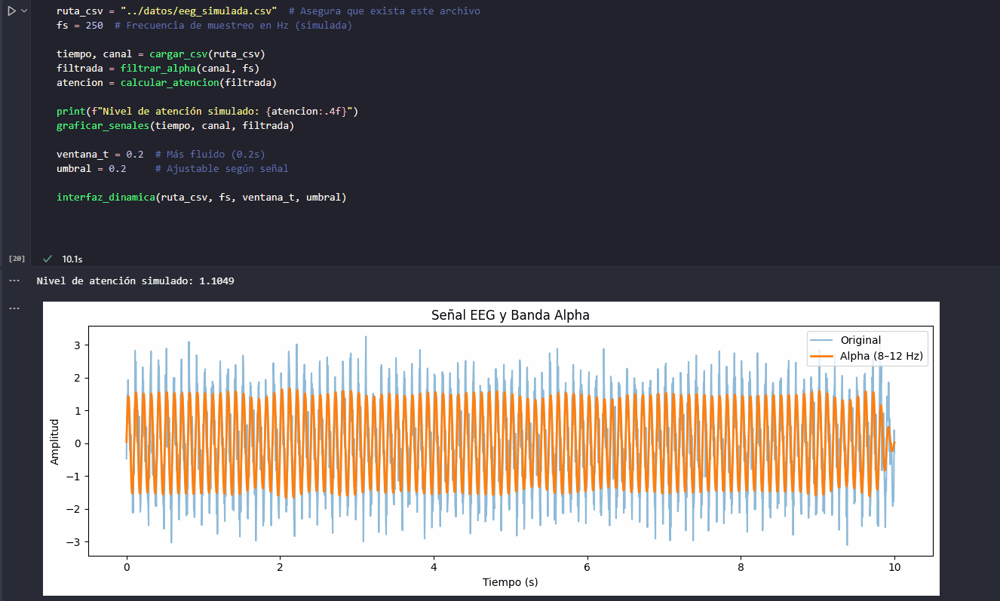
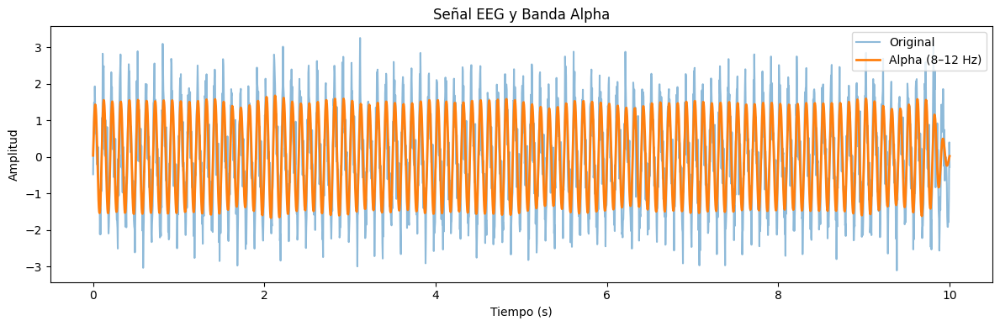

# 🧪 Taller - BCI Simulado: Señales Mentales Artificiales para Control Visual

## 🗓️ Fecha

2025-05-26

---

## 🎯 Objetivo del Taller

Simular el comportamiento de interfaces BCI (Brain-Computer Interface) usando datos generados o precargados para entender el procesamiento básico de señales EEG. Se aplican filtros y condiciones lógicas para traducir la actividad cerebral simulada en una acción visual.

---

## 🧠 Conceptos Aprendidos

* Qué es una señal EEG y cómo se representa digitalmente.
* Uso de filtros pasa banda para aislar bandas cerebrales como Alpha (8–12 Hz).
* Cálculo de potencia de una señal como indicador cognitivo (atención).
* Visualización y simulación de una interfaz BCI en tiempo real con `pygame`.

---

## 🔧 Herramientas y Entornos

* Python (Colab o Jupyter Notebook).
* Librerías: `numpy`, `pandas`, `matplotlib`, `scipy.signal`, `pygame`.
* Datos `.csv` con señales EEG simuladas.

---

## 📁 Estructura del Proyecto

```
2025-05-26_taller_bci_simulado_control_visual/
├── datos/
│   └── eeg_simulada.csv
├── src/
│   └── simulacion_bci.py
├── resultados/
│   ├── señal_eeg_banda_alpha.PNG
│   └── interfaz_interactiva_pygame.gif
└── README.md
```

---

## 🧠 Procesamiento de Señales EEG

### 🔹 Carga de señal EEG desde CSV

```python
# Cargar señales EEG desde CSV
def cargar_csv(ruta):
    df = pd.read_csv(ruta)
    tiempo = df.iloc[:, 0].values
    canal = df.iloc[:, 1].values
    return tiempo, canal
```

Se extrae la columna de tiempo y el canal EEG desde un archivo CSV, simulando un entorno real de adquisición de datos cerebrales.

### 🔹 Filtro pasa banda para banda Alpha (8–12 Hz)

```python
def filtrar_alpha(senal, fs):
    b, a = butter(N=4, Wn=[8, 12], btype='bandpass', fs=fs)
    return filtfilt(b, a, senal)
```

Permite aislar la actividad cerebral en la banda Alpha, asociada comúnmente con estados relajados o de atención ligera.

### 🔹 Cálculo de potencia (nivel de atención)

```python
def calcular_atencion(senal_filtrada):
    potencia = np.mean(senal_filtrada**2)
    return potencia
```

La potencia media de la señal filtrada se interpreta como un indicador de atención, imitando software BCI real.

### 🔹 Visualización comparativa

```python
def graficar_senales(tiempo, original, filtrada):
    plt.figure(figsize=(12, 4))
    plt.plot(tiempo, original, label='Original', alpha=0.5)
    plt.plot(tiempo, filtrada, label='Alpha (8–12 Hz)', linewidth=2)
    plt.xlabel('Tiempo (s)')
    plt.ylabel('Amplitud')
    plt.legend()
    plt.title('Señal EEG y Banda Alpha')
    plt.tight_layout()
    plt.show()
```

Permite observar la diferencia visual entre la señal bruta y la señal filtrada en la banda Alpha.

---

## 🧠 Simulación Visual Dinámica (BCI)

### 🔹 Interfaz con `pygame` que responde a la activación cerebral simulada

```python
# Ciclo principal del entorno visual
if potencia > umbral:
    color_fondo = fondo_activo
    estado = "ALERTA"
else:
    color_fondo = fondo_base
    estado = "RELAJADO"
```

La interfaz cambia de color y estado visual si la potencia supera cierto umbral, simulando una interfaz BCI que detecta estados cognitivos.

### 🔹 Barras e indicadores visuales

```python
pygame.draw.rect(pantalla, color_barra, (100, alto - 150, longitud_barra, 40))
texto_estado = fuente.render(f"Estado: {estado}", True, color_estado)
```

Muestra una barra que representa el nivel de atención junto con un texto que indica el estado actual.

---

## 📈 Resultados Visuales

* GIF de simulación BCI mostrando los cambios de estado:



* Onda EEG filtrada



---

## 🔎 Prompts Utilizados

* "Simular interfaz BCI en Python con pygame"
* "Filtro pasa banda alpha scipy.signal"
* "EEG CSV signal to bandpower visualization"
* "Cómo calcular potencia de una señal en Python"
* "Señales cerebrales artificiales para pruebas BCI"
* "Interfaz visual que responde a datos en tiempo real"
* "Cambiar fondo pygame según valor de potencia"

---

## 💬 Reflexión Final

Este taller permitió explorar los principios básicos de las interfaces cerebro-computador sin necesidad de hardware real. Fue especialmente valioso entender el procesamiento de señales cerebrales en tiempo real y su aplicación en entornos interactivos. La dificultad principal fue manejar la escala y visualización adecuada de la señal EEG y calibrar el umbral de activación. Aprendimos también sobre visualización responsiva con `pygame`, reforzando la relación entre datos y experiencia visual cognitiva.

---
