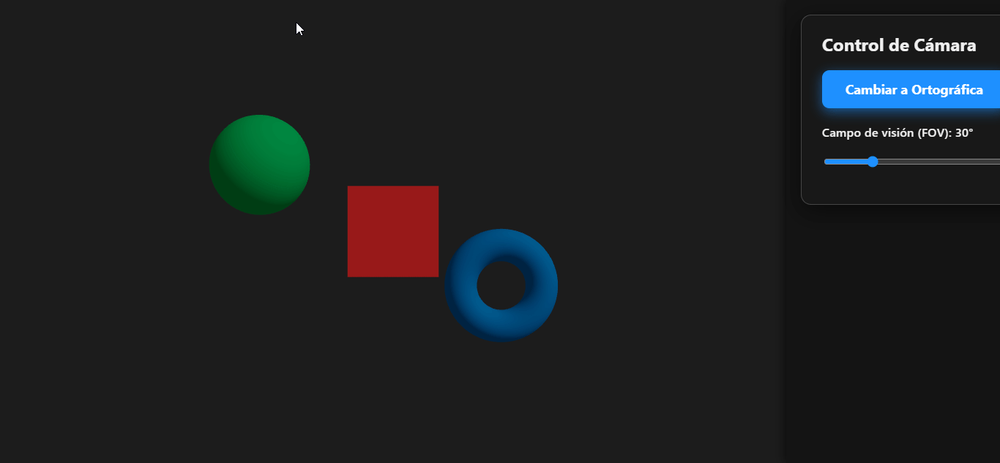
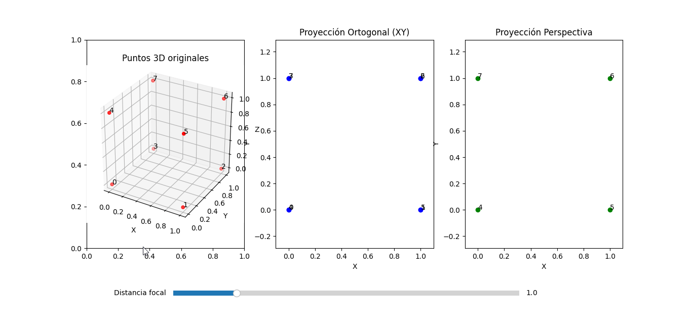
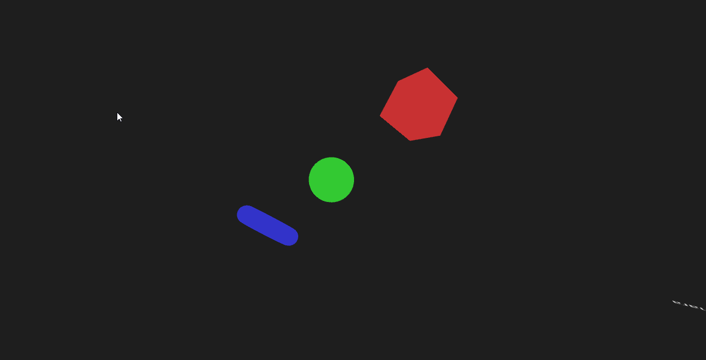

# 🧠 Taller 17 - Espacios Proyectivos y Matrices de Proyección

## 🔍 Objetivo del Taller

Comprender y aplicar los conceptos fundamentales de **geometría proyectiva** y el uso de **matrices de proyección** para representar escenas tridimensionales en un plano bidimensional, base esencial del pipeline gráfico moderno.

---

## 🧠 Conceptos Aprendidos

- Matriz de proyección y transformación de coordenadas 3D a 2D.
- Modelado de cámaras (parámetros intrínsecos y extrínsecos).
- Visualización de rayos, planos y puntos proyectados.
- Interactividad para modificar parámetros de cámara y observar su efecto.
- Organización de proyectos de computación visual con múltiples tecnologías.

---

## 🔧 Herramientas y Entornos

- **Three.js / React Three Fiber** (JavaScript, React, Vite)
- **Python** (para experimentación y visualización matemática)
- **Processing** (visualización interactiva)
- **Leva** para controles de parámetros en la web

---

## 📁 Estructura del Proyecto

```
processing/
    └── solucion.pde
python/
    └── solucion.py
threejs/
    ├── public/
    │   └── vite.svg
    ├── src/
    │   ├── App.jsx
    │   ├── CameraUI.jsx
    │   ├── CameraUI.css
    │   ├── Cameras.jsx
    │   ├── SceneObjects.jsx
    │   ├── assets/
    │   │   └── react.svg
    │   ├── App.css
    │   ├── index.css
    │   └── main.jsx
    ├── index.html
    ├── package.json
    ├── vite.config.js
    ├── eslint.config.js
    └── README.md
```

---

## 🧪 Implementación

### 🔹 Etapas realizadas por tecnología

#### Python

1. Implementación de transformaciones proyectivas y visualización de puntos y líneas.
2. Ejemplos de proyección de puntos 3D a 2D usando matrices.
3. Visualización de resultados y comparación con modelos teóricos.

#### Processing

1. Visualización interactiva de cámaras y proyecciones en 2D/3D.
2. Manipulación de parámetros de cámara en tiempo real.

#### Three.js / React Three Fiber

1. Creación de una escena 3D interactiva con React Three Fiber y Vite.
2. Implementación de componentes para visualizar cámaras, planos y rayos.
3. Controles interactivos para modificar parámetros de cámara (posición, orientación, fov, etc.) usando Leva.
4. Visualización en tiempo real de los efectos de la proyección y la perspectiva.

---

### 🔹 Código relevante

#### Python

Fragmento para proyectar puntos 3D a 2D usando matrices:

```python
import numpy as np

# Definir matriz de proyección y puntos 3D
P = np.array([[fx, 0, cx, 0],
              [0, fy, cy, 0],
              [0,  0,  1, 0]])
X = np.array([Xw, Yw, Zw, 1])
x = P @ X
x = x / x[2]  # Normalizar coordenadas homogéneas
```

#### Processing

Visualización de la proyección de un punto 3D sobre el plano de imagen:

```java
void draw() {
  background(255);
  // Definir parámetros de cámara y punto 3D
  // Dibujar rayos y plano de imagen
  // Dibujar proyección resultante
}
```

#### Three.js / React Three Fiber

Ejemplo de escena con controles de cámara y visualización de rayos:

```jsx
import { Canvas } from "@react-three/fiber";
import { OrbitControls } from "@react-three/drei";
import CameraUI from "./components/CameraUI";
import SceneObjects from "./components/SceneObjects";

<Canvas>
  <ambientLight />
  <SceneObjects />
  <CameraUI />
  <OrbitControls />
</Canvas>;
```

---

## 📊 Resultados Visuales

A continuación se muestran ejemplos de visualización de la proyección de puntos y el efecto de modificar parámetros de cámara en tiempo real, tanto en la web como en entornos de escritorio.







---

## 🧩 Prompts Usados

```text
"¿Cómo proyecto puntos 3D a 2D usando matrices en Python?"
"¿Cómo visualizo la cámara y el plano de imagen en Three.js?"
"¿Cómo implemento controles interactivos para parámetros de cámara?"
```

---

## 💬 Reflexión Final

Este taller permitió comprender de manera práctica cómo los espacios proyectivos y los modelos de cámara afectan la visualización de escenas 3D. La interactividad facilitó la exploración de conceptos teóricos y su impacto visual. El mayor reto fue coordinar la representación coherente entre diferentes tecnologías y asegurar la correcta interpretación de los parámetros de cámara. Para futuros proyectos, sería interesante integrar calibración de cámara y reconstrucción 3D a partir de imágenes reales.

---
