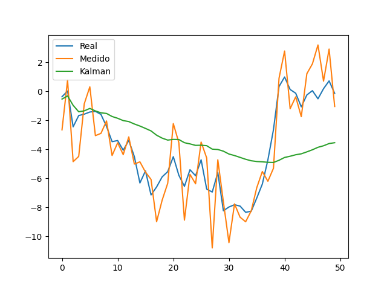

# 🧪 Filtro de Kalman en 1D

## 📅 Fecha
`2025-05-26` – Fecha de entrega

---

## 🎯 Objetivo del Taller

Aprender a implementar el filtro de Kalman para estimar una variable oculta a partir de otras variables observables.
Este taller tiene como objetivo introducir conceptos de inferencia estadística y procesamiento secuencial de señales, aplicables en visión por computador, robótica y predicción de series temporales.

---

## 🧠 Conceptos Aprendidos

- [x] Filtro de Kalman
- [x] Generación de datos sintéticos ruidosos
- [x] Estimación de variables ocultas
- [x] Visualización comparativa de señales
- [x] Inferencia estadística básica

---

## 🔧 Herramientas y Entornos

- Python 3.13
- numpy
- matplotlib

---

## 📁 Estructura del Proyecto

```
2025-05-26_taller_kalman_inferencia/
├── python/               # scripts en Python
├── resultado/            # gráficos generados
├── README.md
```

---

## 🧪 Implementación

### 🔹 Etapas realizadas
1. Se generó una señal real acumulativa aleatoria simulando la posición real de un objeto.
2. Se añadió ruido gaussiano a la señal para simular observaciones incompletas.
3. Se implementó un filtro de Kalman.
4. Se estimó la variable oculta (posición real) a partir de las observaciones ruidosas.
5. Se graficaron las tres señales: real, observada y estimada.

### 🔹 Código relevante

```python
import numpy as np
import matplotlib.pyplot as plt

# Generar datos simulados
real = np.cumsum(np.random.randn(50))
noise = np.random.normal(0, 2, size=50)
observed = real + noise

# Inicialización del filtro
estimate = []
P = 1
x_hat = 0
Q = 0.001
R = 4

for z in observed:
    x_hat_prior = x_hat
    P_prior = P + Q

    K = P_prior / (P_prior + R)
    x_hat = x_hat_prior + K * (z - x_hat_prior)
    P = (1 - K) * P_prior
    estimate.append(x_hat)

# Visualización
plt.plot(real, label='Real')
plt.plot(observed, label='Medido')
plt.plot(estimate, label='Kalman')
plt.legend()
plt.show()
```

---

## 📊 Resultados Visuales

En la gráfica se comparan tres señales: la trayectoria **real** (línea azul), las mediciones **observadas** con ruido (línea naranja) y las estimaciones generadas por el **filtro de Kalman** (línea verde). Se observa que el filtro suaviza las fluctuaciones erráticas del ruido presente en las observaciones y sigue de manera más precisa la tendencia de la señal real. A pesar de que la estimación parte de una condición inicial pobre (valor cero), el filtro va corrigiendo progresivamente sus predicciones a medida que incorpora nuevas mediciones, logrando una reconstrucción eficaz de la variable oculta.



---

## 🧩 Prompts Usados

```text
"Brinda el comando de instalación de las librerías necesarias para hacer este taller"
```

---

## 💬 Reflexión Final

Este taller permitió poner en práctica los fundamentos del filtro de Kalman, desde la generación de los datos hasta su estimación y visualización. Fue útil para comprender cómo se puede inferir una variable oculta a partir de observaciones ruidosas, así como la importancia de ajustar parámetros como el ruido del proceso y de medición.

La parte más interesante fue observar cómo el filtro converge hacia la señal real con el tiempo, aun cuando inicia con una predicción muy distinta. Esta experiencia sienta las bases para explorar las aplicaciones en visión o robótica.

---

## ✅ Checklist de Entrega

- [x] Carpeta `2025-05-26_taller_kalman_inferencia`
- [x] Código limpio y funcional
- [x] Visualización incluida
- [x] README completo y claro

---
