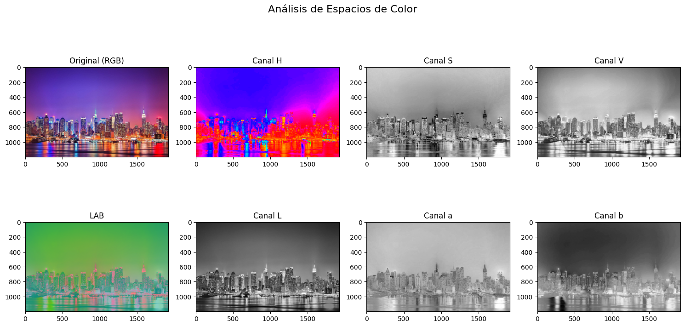
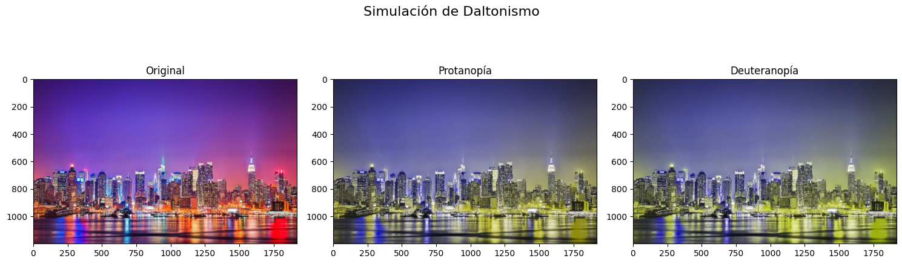
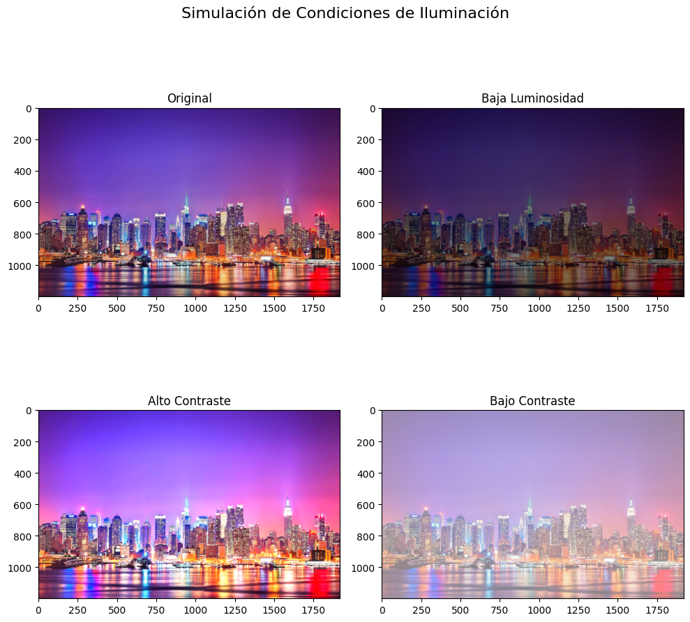

# 🧪 Taller de Espacios de Color y Percepción Visual

## 📅 Fecha
`2024-05-24` 

---

## 🎯 Objetivo del Taller

Explorar y analizar diferentes espacios de color (RGB, HSV, CIE Lab) y su impacto en la percepción visual, incluyendo simulaciones de alteraciones visuales como daltonismo y condiciones de iluminación variadas.

---

## 🧠 Conceptos Aprendidos

- [x] Espacios de color (RGB, HSV, CIE Lab)
- [x] Transformaciones entre espacios de color
- [x] Simulación de deficiencias visuales
- [x] Manipulación de matrices de color
- [x] Ajustes de brillo y contraste
- [x] Efectos visuales personalizados

---

## 🔧 Herramientas y Entornos

Python con las siguientes bibliotecas:
- `opencv-python`: Procesamiento de imágenes y conversión entre espacios de color
- `matplotlib`: Visualización de resultados
- `numpy`: Operaciones matriciales y manipulación de arrays
- `skimage.color`: Funciones avanzadas de procesamiento de color
- `colorsys`: Utilidades adicionales para manipulación de color

---

## 🧪 Implementación

### 🔹 Etapas realizadas

1. **Preparación y Carga de Datos**
   - Carga de imagen usando OpenCV
   - Conversión inicial de BGR a RGB

2. **Análisis de Espacios de Color**
   - Conversión a espacios HSV y CIE Lab
   - Separación y visualización de canales individuales

3. **Simulación de Alteraciones Visuales**
   - Implementación de matrices de transformación para daltonismo
   - Ajustes de brillo y contraste para simular condiciones de iluminación

4. **Transformaciones de Color Personalizadas**
   - Aplicación de filtros de temperatura
   - Generación de efectos monocromáticos e invertidos

### 🔹 Código relevante

```python
class ColorSpaceAnalyzer:
    def __init__(self, image_path):
        self.original = cv2.imread(image_path)
        self.original = cv2.cvtColor(self.original, cv2.COLOR_BGR2RGB)
        
    def show_color_spaces(self):
        # Conversión a HSV
        hsv = cv2.cvtColor(self.original, cv2.COLOR_RGB2HSV)
        h, s, v = cv2.split(hsv)
        
        # Conversión a LAB
        lab = cv2.cvtColor(self.original, cv2.COLOR_RGB2LAB)
        l, a, b = cv2.split(lab)
        
        # Visualización
        fig, axes = plt.subplots(2, 4, figsize=(15, 8))
        fig.suptitle('Análisis de Espacios de Color', fontsize=16)
        
        # RGB
        axes[0,0].imshow(self.original)
        axes[0,0].set_title('Original (RGB)')
        
        # HSV
        axes[0,1].imshow(h, cmap='hsv')
        axes[0,1].set_title('Canal H')
        axes[0,2].imshow(s, cmap='gray')
        axes[0,2].set_title('Canal S')
        axes[0,3].imshow(v, cmap='gray')
        axes[0,3].set_title('Canal V')
        
        # LAB
        axes[1,0].imshow(lab)
        axes[1,0].set_title('LAB')
        axes[1,1].imshow(l, cmap='gray')
        axes[1,1].set_title('Canal L')
        axes[1,2].imshow(a, cmap='gray')
        axes[1,2].set_title('Canal a')
        axes[1,3].imshow(b, cmap='gray')
        axes[1,3].set_title('Canal b')
        
        plt.tight_layout()
        plt.show()
        
    def simulate_color_blindness(self):
        # Matrices de simulación de daltonismo
        protanopia = np.array([[0.567, 0.433, 0],
                             [0.558, 0.442, 0],
                             [0, 0.242, 0.758]])
        
        deuteranopia = np.array([[0.625, 0.375, 0],
                               [0.7, 0.3, 0],
                               [0, 0.3, 0.7]])
        
        # Aplicar simulaciones
        img_protanopia = np.dot(self.original.reshape(-1, 3), protanopia.T).reshape(self.original.shape)
        img_deuteranopia = np.dot(self.original.reshape(-1, 3), deuteranopia.T).reshape(self.original.shape)
        
        # Visualización
        fig, axes = plt.subplots(1, 3, figsize=(15, 5))
        fig.suptitle('Simulación de Daltonismo', fontsize=16)
        
        axes[0].imshow(self.original)
        axes[0].set_title('Original')
        axes[1].imshow(np.clip(img_protanopia, 0, 255).astype(np.uint8))
        axes[1].set_title('Protanopía')
        axes[2].imshow(np.clip(img_deuteranopia, 0, 255).astype(np.uint8))
        axes[2].set_title('Deuteranopía')
        
        plt.tight_layout()
        plt.show()
        
    def simulate_lighting_conditions(self):
        # Ajustes de brillo y contraste
        low_brightness = cv2.convertScaleAbs(self.original, alpha=0.5, beta=0)
        high_contrast = cv2.convertScaleAbs(self.original, alpha=1.5, beta=0)
        low_contrast = cv2.convertScaleAbs(self.original, alpha=0.5, beta=128)
        
        fig, axes = plt.subplots(2, 2, figsize=(10, 10))
        fig.suptitle('Simulación de Condiciones de Iluminación', fontsize=16)
        
        axes[0,0].imshow(self.original)
        axes[0,0].set_title('Original')
        axes[0,1].imshow(low_brightness)
        axes[0,1].set_title('Baja Luminosidad')
        axes[1,0].imshow(high_contrast)
        axes[1,0].set_title('Alto Contraste')
        axes[1,1].imshow(low_contrast)
        axes[1,1].set_title('Bajo Contraste')
        
        plt.tight_layout()
        plt.show()
        
    def apply_color_transformations(self):
        # Temperatura de color
        warm = self.original.copy()
        warm[:,:,2] = np.clip(warm[:,:,2] * 1.2, 0, 255)  # Aumentar componente roja
        
        cool = self.original.copy()
        cool[:,:,0] = np.clip(cool[:,:,0] * 1.2, 0, 255)  # Aumentar componente azul
        
        # Inversión
        inverted = 255 - self.original
        
        # Monocromo
        gray = cv2.cvtColor(self.original, cv2.COLOR_RGB2GRAY)
        monochrome = cv2.cvtColor(gray, cv2.COLOR_GRAY2RGB)
        
        fig, axes = plt.subplots(2, 2, figsize=(10, 10))
        fig.suptitle('Transformaciones de Color', fontsize=16)
        
        axes[0,0].imshow(warm)
        axes[0,0].set_title('Temperatura Cálida')
        axes[0,1].imshow(cool)
        axes[0,1].set_title('Temperatura Fría')
        axes[1,0].imshow(inverted)
        axes[1,0].set_title('Invertido')
        axes[1,1].imshow(monochrome)
        axes[1,1].set_title('Monocromo')
        
        plt.tight_layout()
        plt.show()
```

---

## 📊 Resultados Visuales

### Espacios de Color


### Simulación de Daltonismo


### Condiciones de Iluminación


### Transformación de colores


---

## 🧩 Prompts Usados

```text
"Crea un código en Python con las herramientas: opencv-python, matplotlib, colorsys, skimage.color, numpy. Que haga lo siguiente:
- Cargar una imagen y convertirla entre diferentes espacios de color
- Visualizar los canales individuales y su efecto en la percepción
- Simular alteraciones de visión
- Aplicar transformaciones de color sobre imágenes"
```

---

## 💬 Reflexión Final

Este taller ha permitido profundizar en la comprensión de cómo diferentes espacios de color representan la información visual y cómo estas representaciones afectan la percepción humana. La implementación de simulaciones de daltonismo resultó particularmente interesante, ya que permitió entender mejor las necesidades de accesibilidad en el diseño visual.

La parte más desafiante fue la implementación precisa de las matrices de transformación para simular diferentes tipos de daltonismo, requiriendo una comprensión profunda de cómo el sistema visual humano procesa los colores y cómo estas deficiencias afectan la percepción.

Para futuros proyectos, sería interesante expandir estas técnicas para incluir más tipos de deficiencias visuales y desarrollar herramientas que ayuden a crear contenido más accesible. También se podría explorar la automatización de ajustes de color para optimizar la visibilidad en diferentes condiciones de visualización.

