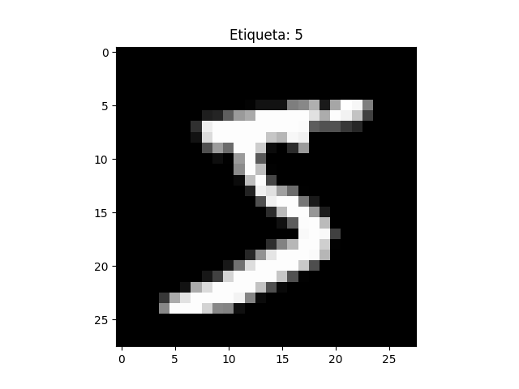
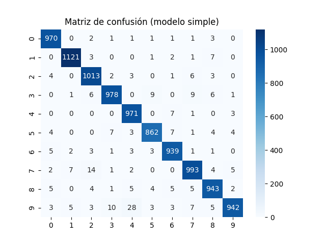

# 🧪 Taller - Entrenamiento y Fine-Tuning de un Modelo Deep Learning en MNIST

## 🗓️ Fecha

2025-06-12

---

## 🎯 Objetivo del Taller

Entrenar un modelo de deep learning sobre el dataset MNIST, aplicar técnicas de validación y realizar fine-tuning utilizando un modelo preentrenado. Analizar el impacto del fine-tuning y comparar los resultados obtenidos.

---

## 🧠 Conceptos Aprendidos

* Carga y preprocesamiento de datos con PyTorch.
* Definición y entrenamiento de redes neuronales simples.
* Validación cruzada (K-Fold) y su importancia.
* Fine-tuning de modelos preentrenados (ResNet18).
* Evaluación de modelos: curvas de pérdida, matriz de confusión y métricas de desempeño.
* Comparación de resultados entre modelos desde cero y modelos ajustados.

---

## 🛠️ Herramientas y Entornos

* Python 3.x
* PyTorch y torchvision
* Scikit-learn
* Matplotlib y Seaborn
* Pandas

---

## 📁 Estructura del Proyecto

```
2025-06-12_taller_entrenamiento_modelo_deep_learning_completo/
├── data/
│   └── MNIST/
├── modelos/
│   └── modelo_final.pth
├── resultados/
│   ├── curva_loss.png
│   ├── confusion_matrix.png
│   ├── comparacion_metrics.csv
│   └── ejemplo_mnist.png
└── python/
    └── entrenamiento_modelo.py
```

---

## 💡 Implementación Destacada

### 🔹 Carga y visualización del dataset MNIST

```python
transform = transforms.Compose([
    transforms.ToTensor(),
    transforms.Normalize((0.5,), (0.5,))
])
train_data = datasets.MNIST(root=data_dir, train=True, download=True, transform=transform)
test_data = datasets.MNIST(root=data_dir, train=False, download=True, transform=transform)
```
*Se utiliza el dataset MNIST, que contiene imágenes de dígitos manuscritos (28x28 píxeles, escala de grises).*

### 🔹 Visualización de un ejemplo

```python
def visualizar_ejemplo(dataset):
    image, label = dataset[0]
    plt.imshow(image.squeeze(), cmap="gray")
    plt.title(f"Etiqueta: {label}")
    plt.savefig(os.path.join(resultados_dir, "ejemplo_mnist.png"))
    plt.close()
visualizar_ejemplo(train_data)
```
*Se guarda una imagen de ejemplo para inspección visual.*

### 🔹 Definición del modelo simple

```python
class SimpleNN(nn.Module):
    def __init__(self):
        super().__init__()
        self.net = nn.Sequential(
            nn.Flatten(),
            nn.Linear(28*28, 128),
            nn.ReLU(),
            nn.Dropout(0.2),
            nn.Linear(128, 64),
            nn.ReLU(),
            nn.Linear(64, 10)
        )
    def forward(self, x):
        return self.net(x)
```
*Red neuronal simple con dos capas ocultas y dropout para regularización.*

### 🔹 Entrenamiento y validación

```python
def entrenar_modelo(model, train_loader, val_loader, epochs=10, lr=0.001, device="cpu"):
    criterion = nn.CrossEntropyLoss()
    optimizer = optim.Adam(model.parameters(), lr=lr)
    train_losses, val_losses, val_accuracies = [], [], []
    for epoch in range(epochs):
        # Entrenamiento y validación...
    return train_losses, val_losses, val_accuracies
```
*Función genérica para entrenar y validar el modelo, guardando las curvas de pérdida.*

### 🔹 Fine-tuning con modelo preentrenado

```python
model_ft = models.resnet18(weights=models.ResNet18_Weights.DEFAULT)
for param in model_ft.parameters():
    param.requires_grad = False
model_ft.conv1 = nn.Conv2d(1, 64, kernel_size=7, stride=2, padding=3, bias=False)
num_ftrs = model_ft.fc.in_features
model_ft.fc = nn.Linear(num_ftrs, 10)
```
*Se adapta ResNet18 para imágenes de un canal y se ajusta solo la capa final para el fine-tuning.*

### 🔹 Comparación de métricas

```python
metrics = {
    "Modelo": ["SimpleNN", "ResNet18 (fine-tuning)"],
    "Accuracy": [np.mean(kfold_metrics), np.mean(ft_val_accuracies)],
    "Precision": [...],
    "Recall": [...]
}
df_metrics = pd.DataFrame(metrics)
df_metrics.to_csv(os.path.join(resultados_dir, "comparacion_metrics.csv"), index=False)
```
*Se guardan las métricas de ambos modelos para comparación.*

---

## 📊 Resultados Visuales

* Ejemplo de imagen MNIST:  
  
* Curva de pérdida durante el entrenamiento:  
  
* Matriz de confusión del modelo simple:  
  
* Comparación de métricas (accuracy, precision, recall):  
  Archivo: `comparacion_metrics.csv`

---

## 🔎 Prompts Utilizados

* "cómo hacer fine-tuning en PyTorch con ResNet18"
* "validación cruzada k-fold en PyTorch"
* "cómo guardar y cargar modelos en PyTorch"
* "cómo graficar matriz de confusión y curvas de pérdida"
* "adaptar ResNet para imágenes de un canal"

---

## 💬 Reflexión Final

El fine-tuning permite aprovechar el conocimiento previo de modelos grandes, pero su efectividad depende de la similitud entre el dataset original y el nuevo. En este caso, el modelo simple entrenado desde cero superó al modelo ajustado (ResNet18), probablemente porque MNIST es un dataset muy diferente a los datos originales de ResNet (ImageNet, imágenes a color y de mayor resolución). La validación cruzada K-Fold fue especialmente útil para estimar la variabilidad del desempeño y evitar sobreajuste. En resumen, el fine-tuning no siempre garantiza mejores resultados, pero es una herramienta poderosa cuando se usa en contextos adecuados. 