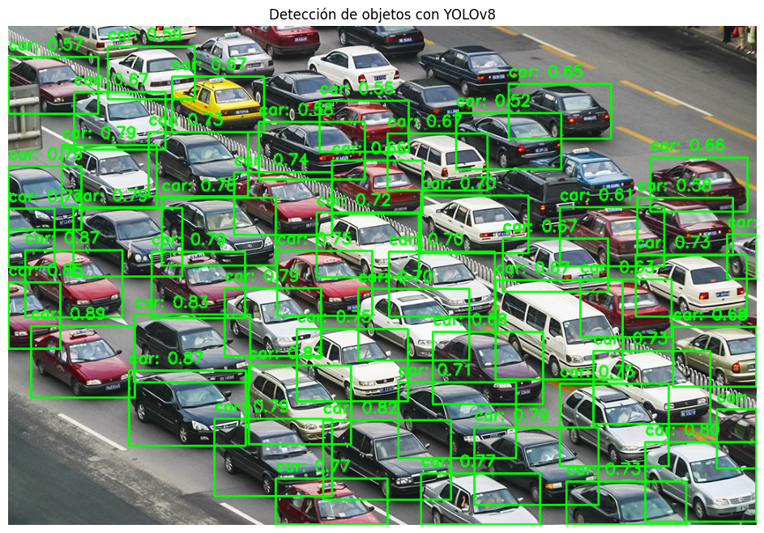
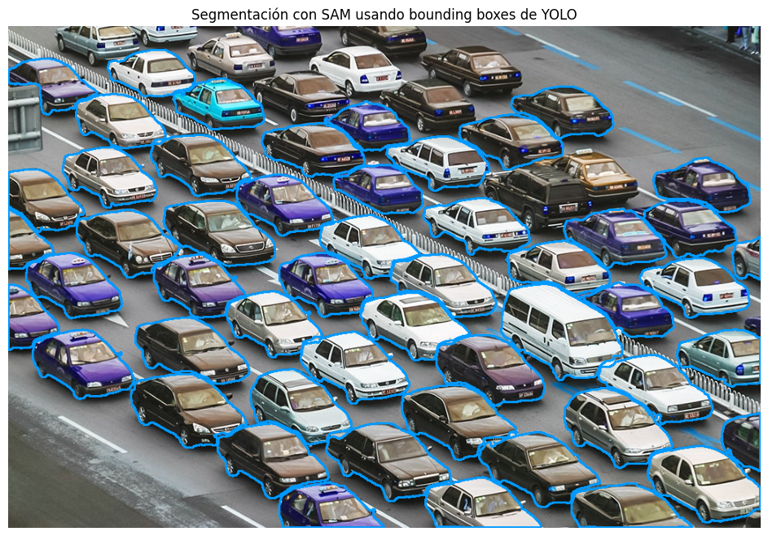
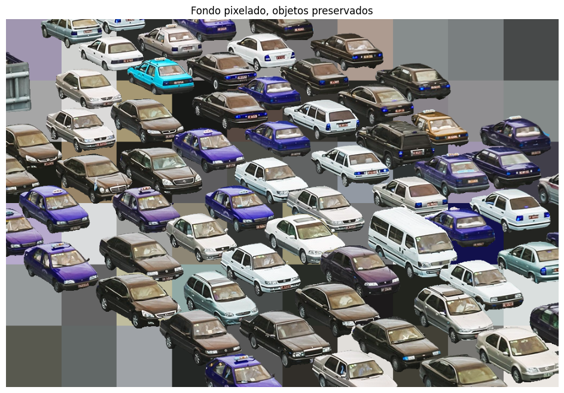
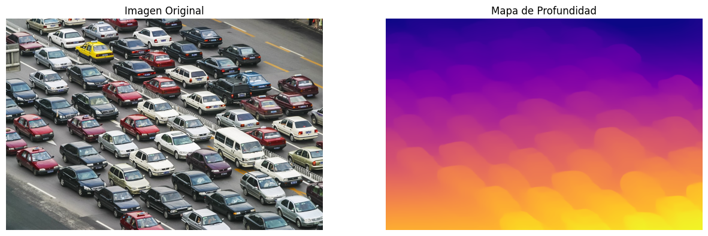
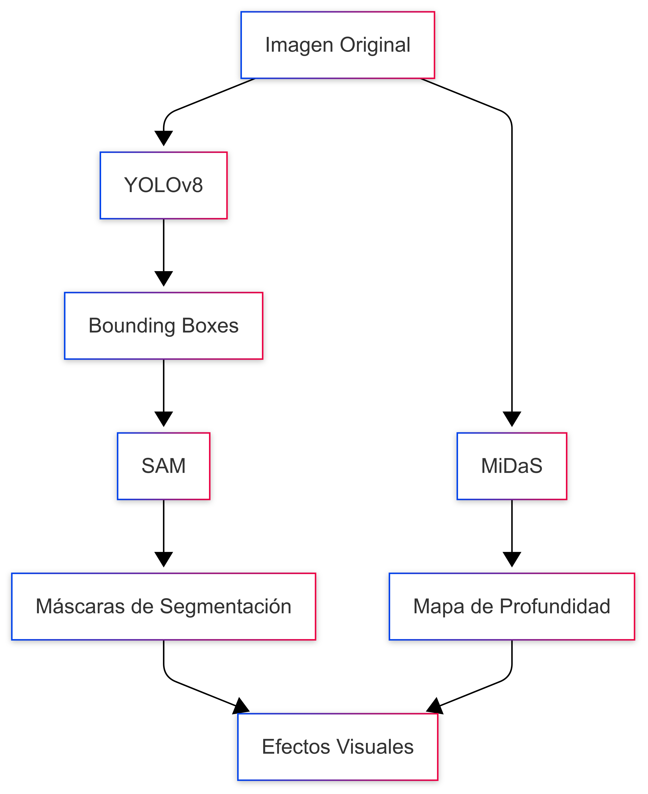

# Informe Taller Pipelines YOLO-SAM-MiDaS

## 1. Análisis del Colab "digits_recognition_cnn"

### 1.1 Carga de datos MNIST

El notebook utiliza el dataset **MNIST**, que contiene 60,000 imágenes de entrenamiento y 10,000 de prueba de dígitos manuscritos (0-9), cada una de **28x28 píxeles** en escala de grises. Se cargan usando `tf.keras.datasets.mnist`.

### 1.2 Visualización de imágenes

Se visualizan ejemplos de las imágenes tanto en forma de matriz de valores como gráficamente usando **matplotlib**, permitiendo observar la variedad de escrituras de los dígitos.

### 1.3 Preprocesamiento: reshape + normalización

* **Reshape:** Las imágenes se transforman de `(28, 28)` a `(28, 28, 1)` para añadir el canal de color necesario para la CNN.
* **Normalización:** Los valores de los píxeles se escalan de `[0, 255]` a `[0, 1]` para mejorar el rendimiento del modelo.

### 1.4 Construcción del modelo CNN

Se construye un modelo secuencial de Keras con la siguiente arquitectura:

* Dos capas de **convolución (Conv2D)** con activación ReLU y **max pooling**.
* Una capa de **flatten** para vectorizar la salida.
* Una capa **densa (Dense)** intermedia con activación ReLU y **dropout**.
* Una capa de salida **densa** con activación **softmax** para clasificar los 10 dígitos.

### 1.5 Entrenamiento y validación

El modelo se entrena usando los datos preprocesados, validando su desempeño en el conjunto de prueba. Se utilizan métricas como la **precisión** para evaluar el aprendizaje.

### 1.6 Evaluación y exportación

Se evalúa el modelo en el set de test y se pueden visualizar métricas como la **matriz de confusión**. Finalmente, el modelo puede ser exportado para su uso posterior.

---

## Resumen

### Lo aprendido

* Cómo preparar y visualizar datos de imágenes para aprendizaje profundo.
* La importancia del preprocesamiento (reshape y normalización) en imágenes.
* Construcción y entrenamiento de una red neuronal convolucional (CNN) para clasificación de imágenes.
* Evaluación de modelos y análisis de resultados con métricas visuales y numéricas.

### Aplicación al taller actual

* Las técnicas de preprocesamiento y visualización pueden aplicarse a cualquier conjunto de imágenes.
* La estructura básica de la CNN puede adaptarse para reconocer otros patrones visuales, no solo dígitos.
* El flujo de trabajo (carga, visualización, preprocesamiento, modelado, entrenamiento, evaluación) es aplicable a cualquier proyecto de visión por computador.
* El uso de **TensorFlow/Keras** y herramientas de visualización como **matplotlib** es transferible a otros problemas de clasificación de imágenes.

## 2. Implementación con YOLO + SAM + MiDaS

## 📸 Capturas del Proceso y Resultados

El pipeline integra tres modelos de visión artificial para generar diferentes visualizaciones:

### Detección y Segmentación
- **YOLOv8**: Detección de objetos con cajas delimitadoras y scores de confianza

- **SAM (Segment Anything Model)**: Segmentación precisa de objetos usando los bounding boxes de YOLO

### Efectos Visuales y Profundidad
- **Pixelado Selectivo**: Preservación de objetos detectados con fondo pixelado

- **MiDaS**: Estimación de profundidad monocular

---

## 🧩 Diagrama del Pipeline

---

## 🧠 Explicación del Uso de Cada Modelo

### YOLOv8
- Detección inicial de objetos
- Genera bounding boxes con scores de confianza
- Proporciona las coordenadas base para SAM

### SAM (Segment Anything Model)
- Recibe los bounding boxes de YOLO
- Genera máscaras de segmentación precisas
- Permite separar objetos del fondo

### MiDaS
- Estima la profundidad de la escena
- Genera un mapa de calor de profundidad
- Ayuda a entender la distribución espacial 3D

---

## 📊 Análisis Visual

El pipeline permite varios tipos de análisis:

- **Detección**: YOLO identifica vehículos con alta precisión y confianza
- **Segmentación**: SAM genera máscaras precisas que respetan los bordes
- **Profundidad**: MiDaS revela la estructura espacial del estacionamiento
- **Efectos**: El pixelado selectivo demuestra la precisión de la segmentación

---

## 🌍 Aplicaciones Prácticas

| Aplicación | Descripción |
|------------|-------------|
| **Vigilancia** | Monitoreo automático de estacionamientos y control de acceso |
| **Análisis de Tráfico** | Conteo de vehículos y análisis de ocupación |
| **Privacidad** | Pixelado selectivo para proteger información sensible |
| **Mapeo 3D** | Reconstrucción de escenas usando información de profundidad |