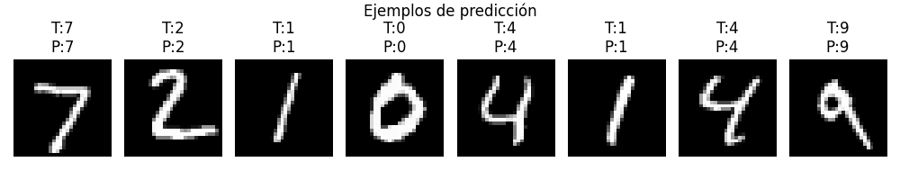
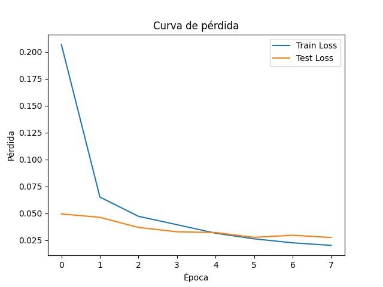
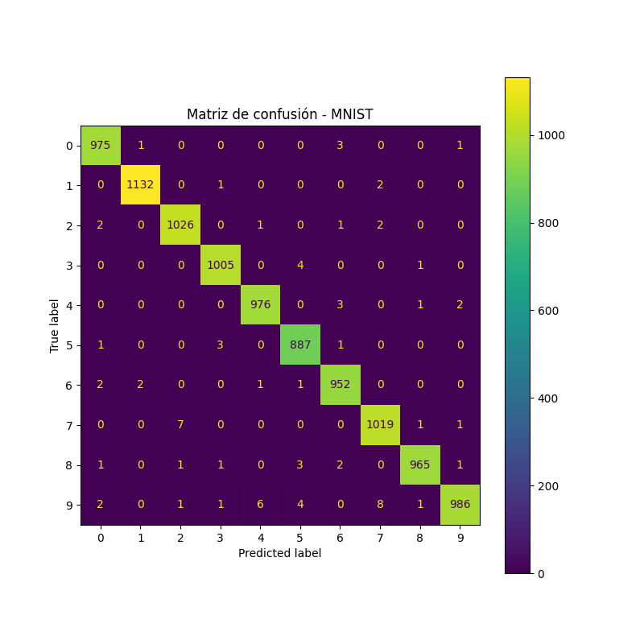

# 🧪 Taller - Red Neuronal Convolucional Básica en MNIST con PyTorch

## 🗓️ Fecha

2025-06-19

---

## 🎯 Objetivo del Taller

Implementar y entrenar una red neuronal convolucional (CNN) básica para clasificación de dígitos manuscritos usando el dataset MNIST. Analizar el impacto de los filtros y capas en el desempeño, y visualizar los resultados obtenidos.

---

## 🧠 Conceptos Aprendidos

* Estructura y componentes de una CNN: capas convolucionales, pooling, fully connected, dropout.
* Preprocesamiento y normalización de imágenes.
* Entrenamiento supervisado y evaluación de modelos.
* Visualización de métricas: curvas de pérdida, precisión y matriz de confusión.
* Interpretación de predicciones y errores del modelo.

---

## 🛠️ Herramientas y Entornos

* Python 3.x
* PyTorch y torchvision
* Matplotlib
* Scikit-learn

---

## 📁 Estructura del Proyecto

```
2025-06-19_taller_cnn_basico_deep_learning_keras_pytorch/
├── data/
│   └── MNIST/
├── modelo/
│   └── cnn_mnist.pt
├── resultados/
│   ├── sample_predictions.png
│   ├── accuracy_curve.png
│   ├── loss_curve.png
│   └── confusion_matrix.png
└── pytorch/
    └── cnn_pytorch.py
```

---

## 💡 Implementación Destacada

### 🔹 Carga y preprocesamiento de datos

```python
transform = transforms.Compose([
    transforms.ToTensor(),
    transforms.Normalize((0.1307,), (0.3081,))
])
train_dataset = datasets.MNIST(root=DATA_DIR, train=True, download=True, transform=transform)
test_dataset = datasets.MNIST(root=DATA_DIR, train=False, download=True, transform=transform)
```
*Las imágenes se normalizan para mejorar la estabilidad del entrenamiento.*

### 🔹 Arquitectura de la CNN

```python
class SimpleCNN(nn.Module):
    def __init__(self):
        super(SimpleCNN, self).__init__()
        self.conv1 = nn.Conv2d(1, 16, kernel_size=3, padding=1)
        self.pool = nn.MaxPool2d(2, 2)
        self.conv2 = nn.Conv2d(16, 32, kernel_size=3, padding=1)
        self.fc1 = nn.Linear(32 * 7 * 7, 128)
        self.fc2 = nn.Linear(128, 10)
        self.dropout = nn.Dropout(0.25)
    def forward(self, x):
        x = self.pool(F.relu(self.conv1(x)))
        x = self.pool(F.relu(self.conv2(x)))
        x = x.view(-1, 32 * 7 * 7)
        x = F.relu(self.fc1(x))
        x = self.dropout(x)
        x = self.fc2(x)
        return x
```
*La red consta de dos capas convolucionales (con filtros 3x3), seguidas de pooling, y dos capas totalmente conectadas. El dropout ayuda a evitar el sobreajuste.*

### 🔹 Entrenamiento y evaluación

```python
def train():
    model.train()
    running_loss = 0.0
    correct, total = 0, 0
    for images, labels in train_loader:
        images, labels = images.to(DEVICE), labels.to(DEVICE)
        optimizer.zero_grad()
        outputs = model(images)
        loss = criterion(outputs, labels)
        loss.backward()
        optimizer.step()
        running_loss += loss.item() * images.size(0)
        _, predicted = torch.max(outputs, 1)
        correct += (predicted == labels).sum().item()
        total += labels.size(0)
    return running_loss / total, correct / total
```
*Función de entrenamiento que actualiza los pesos y calcula la precisión.*

### 🔹 Visualización de resultados

```python
plt.plot(train_losses, label='Train Loss')
plt.plot(test_losses, label='Test Loss')
plt.xlabel('Época')
plt.ylabel('Pérdida')
plt.legend()
plt.title('Curva de pérdida')
plt.savefig(os.path.join(RESULTS_DIR, 'loss_curve.png'))
```
*Se grafican las curvas de pérdida para analizar el aprendizaje.*

### 🔹 Matriz de confusión y predicciones

```python
cm = confusion_matrix(y_true, y_pred)
disp = ConfusionMatrixDisplay(confusion_matrix=cm, display_labels=list(range(10)))
disp.plot(ax=ax)
plt.title('Matriz de confusión - MNIST')
plt.savefig(os.path.join(RESULTS_DIR, 'confusion_matrix.png'))
```
*La matriz de confusión permite identificar los errores más comunes del modelo.*

---

## 📊 Resultados Visuales

* Ejemplos de predicción:  
  
* Curva de precisión durante el entrenamiento:  
  
* Curva de pérdida durante el entrenamiento:  
  
* Matriz de confusión:  
  

---

## 🔎 Prompts Utilizados

* "cómo crear una CNN simple en PyTorch"
* "cómo visualizar la matriz de confusión en sklearn"
* "cómo graficar curvas de pérdida y precisión en matplotlib"
* "cómo guardar y cargar modelos en PyTorch"

---

## 💬 Reflexión Final

Aprendí que los filtros en las capas convolucionales permiten extraer características locales importantes, como bordes y formas, que son esenciales para el reconocimiento de dígitos. El uso de pooling reduce la dimensionalidad y ayuda a generalizar mejor. La adición de dropout y el ajuste de la cantidad de filtros/capas mejoraron la precisión y redujeron el sobreajuste. Visualizar las curvas y la matriz de confusión fue clave para entender el comportamiento del modelo y detectar posibles mejoras. 