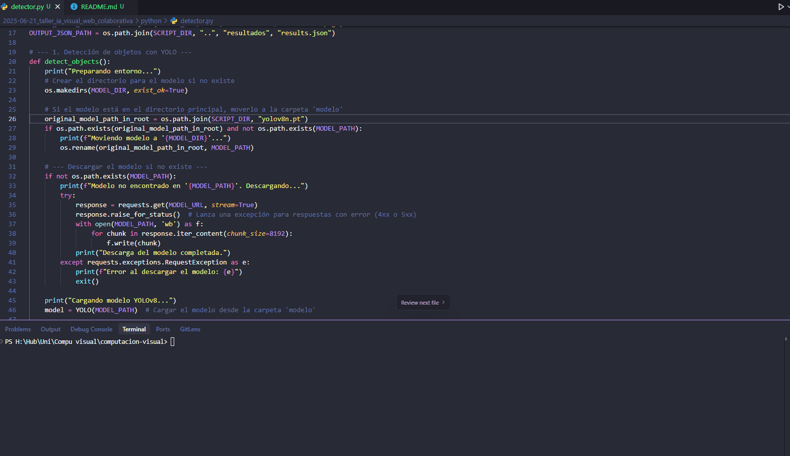
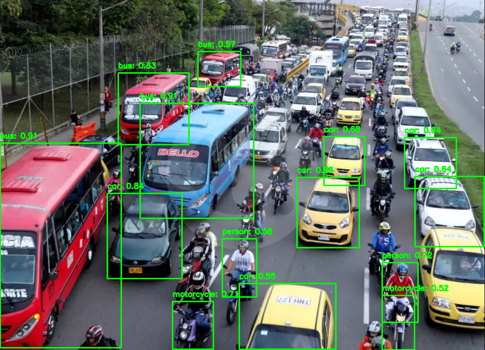

# 🧪 Taller - IA Visual Web Colaborativa

## 🗓️ Fecha

2025-06-21

---

## 🎯 Objetivo del Taller

Desarrollar una solución de IA visual que detecta objetos en imágenes usando Python y muestra los resultados de manera interactiva en una interfaz web colaborativa. Se busca integrar el procesamiento de modelos de visión por computadora con visualización web para facilitar la colaboración y el análisis visual.

---

## 🧠 Conceptos Aprendidos

* Detección de objetos con modelos preentrenados (YOLOv8).
* Procesamiento y anotación de imágenes en Python.
* Exportación de resultados en formatos interoperables (JSON, PNG).
* Visualización 3D interactiva de resultados en la web con React y Three.js.
* Integración de flujos Python ↔ Web para colaboración visual.

---

## 🛠️ Herramientas y Entornos

* Python 3.x
* OpenCV
* Ultralytics YOLOv8
* React + Vite
* @react-three/fiber, drei
* HTML, CSS, JavaScript

---

## 📁 Estructura del Proyecto

```
2025-06-21_taller_ia_visual_web_colaborativa/
├── modelo/
│   └── yolov8n.pt
├── python/
│   ├── detector.py
│   └── input_image.jpg
├── resultados/
│   ├── deteccion.png
│   ├── results.json
│   ├── visor_detecciones_web.gif
│   └── procesamiento_modelo.gif
└── web/
    ├── src/
    │   └── App.jsx
    └── ...
```

---

## 💡 Implementación Destacada

### 🔹 Detección y procesamiento en Python

```python
from ultralytics import YOLO
import cv2, json, os

model = YOLO('modelo/yolov8n.pt')
img = cv2.imread('python/input_image.jpg')
results = model(img)[0]

detections = []
for box in results.boxes:
    x1, y1, x2, y2 = [int(coord) for coord in box.xyxy[0]]
    confidence = float(box.conf[0])
    class_id = int(box.cls[0])
    class_name = results.names[class_id]
    if confidence > 0.5:
        cv2.rectangle(img, (x1, y1), (x2, y2), (0, 255, 0), 2)
        label = f"{class_name}: {confidence:.2f}"
        cv2.putText(img, label, (x1, y1 - 10), cv2.FONT_HERSHEY_SIMPLEX, 0.5, (0, 255, 0), 2)
        detections.append({
            "class": class_name,
            "confidence": confidence,
            "box": [x1, y1, x2-x1, y2-y1]
        })
cv2.imwrite('resultados/deteccion.png', img)
with open('resultados/results.json', 'w') as f:
    json.dump({"objects": detections}, f, indent=2)
```
*Se detectan objetos en la imagen (carros, buses, motos, personas), se anotan visualmente y se exportan los resultados a JSON y PNG.*

### 🔹 Visualización interactiva en la web

```jsx
// Carga detecciones y visualiza cajas 3D sobre la imagen
useEffect(() => {
  fetch('./resultados/results.json')
    .then(res => res.json())
    .then(data => setDetections(data.objects || []));
}, []);

<Canvas camera={{ position: [0, 0, 20], fov: 75 }}>
  <Scene
    detections={detections}
    onSelect={handleSelect}
    selectedId={selectedId}
  />
</Canvas>
```
*La interfaz web carga los resultados y permite explorar las detecciones en 3D.*

### 🔹 Renderizado de cajas de detección

```jsx
function DetectionBox({ detection, scale, imageSize, isSelected, onClick }) {
  // ...
  <Box args={[w * scale, h * scale, 1]}>
    <meshBasicMaterial color={isSelected ? '#ff4081' : 'lime'} wireframe />
  </Box>
  <Html position={[0, (-h / 2) * scale - 0.2, 0]}>
    <div>{className} ({confidence.toFixed(2)})</div>
  </Html>
}
```
*Cada detección se muestra como una caja 3D interactiva sobre la imagen.*

### 🔹 Panel de detecciones

```jsx
function DetectionsPanel({ detections, onSelect, selectedId }) {
  return (
    <div className="panel">
      <h3>Detecciones ({detections.length})</h3>
      <ul>
        {detections.map((det, index) => (
          <li key={index} onClick={() => onSelect(index)}>
            <p>{det.class}</p>
            <p>Confianza: {(det.confidence * 100).toFixed(1)}%</p>
          </li>
        ))}
      </ul>
    </div>
  );
}
```
*Panel lateral que permite seleccionar y resaltar detecciones.*

### 🔹 Exportación y compatibilidad

```python
with open('resultados/results.json', 'w') as f:
    json.dump({"objects": detections}, f, indent=2)
```
*Los resultados se exportan en JSON para ser consumidos por la web.*

---

## 📊 Resultados Visuales
* GIF de la interfaz web mostrando resultados:  
  
* GIF de la interfaz web mostrando resultados:  
  
* Imagen procesada con anotaciones:  
  

---

## 🔎 Prompts Utilizados

* "cómo usar YOLOv8 en Python para detección de objetos"
* "cómo exportar resultados de detección a JSON"
* "cómo visualizar bounding boxes en React Three Fiber"
* "cómo cargar imágenes y datos en una app React"

---

## 💬 Reflexión Final

Compartir visualmente los resultados de IA facilita la comprensión y discusión entre equipos multidisciplinarios. La integración Python-Web permite que los resultados sean accesibles y explorables por cualquier colaborador, sin necesidad de conocimientos técnicos avanzados. Esto mejora la colaboración, acelera la iteración y permite detectar errores o patrones de manera más intuitiva. En el futuro, se podría mejorar permitiendo comentarios en tiempo real, exportación de reportes o integración con otras herramientas colaborativas. 