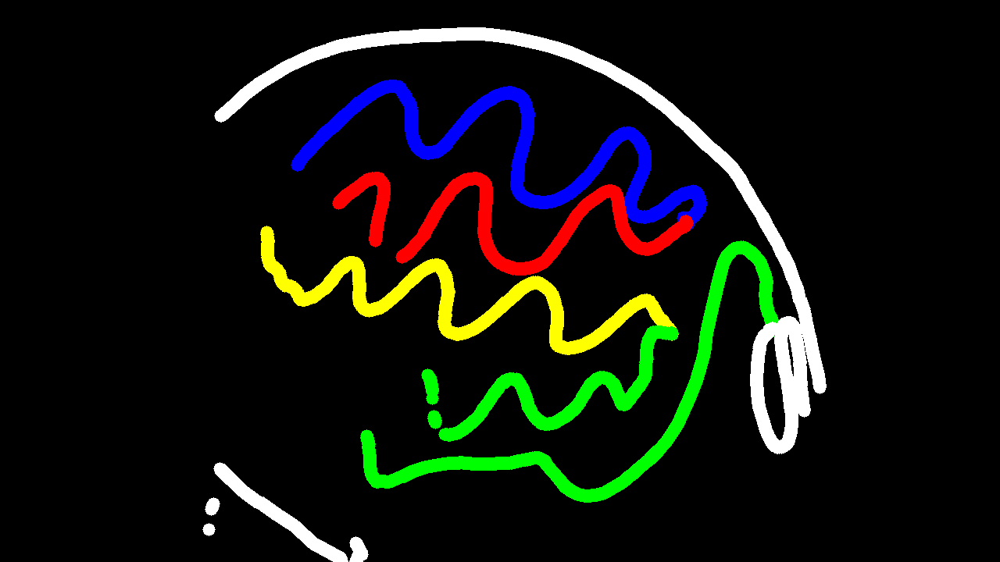

# 🧪 Taller - Pintura Interactiva con Voz y Gestos

## 🗓️ Fecha

2025-06-21

---

## 🎯 Objetivo del Taller

Explorar la creatividad digital mediante la combinación de reconocimiento de voz y gestos para crear obras visuales interactivas. El objetivo es experimentar con interfaces naturales, permitiendo pintar en un lienzo virtual usando el cuerpo y comandos de voz.

---

## 🧠 Conceptos Aprendidos

* Integración de reconocimiento de voz y gestos en tiempo real.
* Control de acciones visuales mediante comandos hablados.
* Detección de manos y seguimiento de dedos con MediaPipe.
* Sincronización de hilos para interacción multimodal.
* Creatividad computacional y arte digital interactivo.

---

## 🛠️ Herramientas y Entornos

* Python 3.x
* OpenCV
* MediaPipe
* SpeechRecognition
* Numpy

---

## 📁 Estructura del Proyecto

```
2025-06-21_taller_pintura_interactiva_voz_gestos/
├── python/
│   └── pintura_interactiva.py
├── resultados/
│   └── LinkDemostracion.txt
├── obras/
│   └── obra_20250625_010607.png
```

---

## 💡 Implementación Destacada

### 🔹 Flujo voz + gestos → acción visual

```python
# Hilo de reconocimiento de voz
def voice_recognizer():
    # Cambia color, modo, limpia o guarda según el comando hablado
    if "limpiar" in command:
        canvas = np.zeros((720, 1280, 3), dtype=np.uint8)
    elif "guardar" in command:
        filename = f"../obras/obra_{time.strftime('%Y%m%d_%H%M%S')}.png"
        cv2.imwrite(filename, canvas)
    elif "pincel" in command:
        is_drawing_mode = True
    elif "borrador" in command:
        is_drawing_mode = False
    # Cambia color si se menciona en voz
```
*El sistema escucha comandos de voz para cambiar color, limpiar, guardar o alternar entre pincel y borrador.*

### 🔹 Detección de gestos y dibujo

```python
# Seguimiento del dedo índice con MediaPipe
if results.multi_hand_landmarks:
    index_finger_tip = hand_landmarks.landmark[mp_hands.HandLandmark.INDEX_FINGER_TIP]
    cx, cy = int(index_finger_tip.x * w), int(index_finger_tip.y * h)
    # Si los dedos índice y medio están juntos, se activa el trazo
    if is_active:
        draw_color = current_color if is_drawing_mode else (0, 0, 0)
        cv2.line(canvas, prev_pos, (cx, cy), draw_color, brush_size)
```
*El trazo se activa con un gesto de dedos juntos y sigue el movimiento del dedo índice.*

### 🔹 Combinación de lienzo y cámara

```python
gray_canvas = cv2.cvtColor(canvas, cv2.COLOR_BGR2GRAY)
_, inv_mask = cv2.threshold(gray_canvas, 1, 255, cv2.THRESH_BINARY_INV)
frame_bg = cv2.bitwise_and(frame, frame, mask=inv_mask)
canvas_fg = cv2.bitwise_and(canvas, canvas, mask=~inv_mask)
combined_view = cv2.add(frame_bg, canvas)
cv2.imshow("Pintura Interactiva con Voz y Gestos", combined_view)
```
*El lienzo se superpone a la imagen de la cámara para una experiencia inmersiva.*

### 🔹 Ejecución en paralelo de voz y gestos

```python
voice_thread = threading.Thread(target=voice_recognizer, daemon=True)
voice_thread.start()
hand_drawing()
```
*El reconocimiento de voz y la detección de gestos funcionan simultáneamente.*

### 🔹 Guardado automático de obras

```python
elif "guardar" in command:
    filename = f"../obras/obra_{time.strftime('%Y%m%d_%H%M%S')}.png"
    cv2.imwrite(filename, canvas)
```
*Se puede guardar la obra final con un comando de voz.*

---

## 📊 Resultados Visuales

* Video demostración del proceso de dibujo interactivo:  
  [Ver video en YouTube](https://youtu.be/N0au3obDA8c?si=P51MNNgeolPnx9Gs)
* Imagen final de la obra creada:  
  

---

## 🔎 Prompts Utilizados

* "cómo usar MediaPipe para detectar gestos de la mano en Python"
* "cómo controlar acciones con comandos de voz en Python"
* "cómo combinar OpenCV y reconocimiento de voz"
* "cómo superponer un lienzo sobre la cámara en tiempo real"

---

## 💬 Reflexión Final

Pintar con el cuerpo y la voz fue una experiencia creativa y divertida. La sensación de controlar el color, el modo y el trazo solo con gestos y palabras hace que el proceso artístico sea más libre y expresivo. Este tipo de interfaces naturales pueden inspirar nuevas formas de arte digital y hacer la tecnología más accesible e inclusiva. Me sentí como si el lienzo respondiera a mi intención, no solo a mis movimientos, y eso abre muchas posibilidades para la creatividad. 