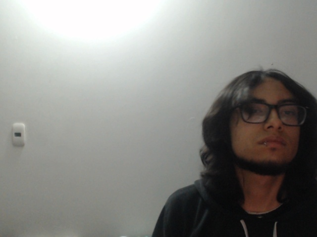

# 🧪 Taller - Sistema de Monitoreo Inteligente con Visión y Dashboard

## 🗓️ Fecha

2025-06-21

---

## 🎯 Objetivo del Taller

Desarrollar un sistema de monitoreo inteligente que detecta personas y objetos en tiempo real usando visión por computadora, visualiza los resultados en un panel interactivo y registra eventos relevantes en logs exportables. El objetivo es integrar detección, visualización y registro para aplicaciones de seguridad y monitoreo.

---

## 🧠 Conceptos Aprendidos

* Detección de objetos en video en tiempo real con YOLOv8.
* Visualización de resultados y estadísticas en un panel (dashboard) en OpenCV.
* Registro automático de eventos y exportación de logs en formato CSV.
* Integración de flujos de captura, procesamiento, visualización y registro.
* Buenas prácticas para sistemas de monitoreo robustos.

---

## 🛠️ Herramientas y Entornos

* Python 3.x
* OpenCV
* Ultralytics YOLOv8
* Numpy
* CSV

---

## 📁 Estructura del Proyecto

```
2025-06-21_taller_sistema_monitoreo_inteligente_vision_dashboard/
├── modelo/
│   └── yolov8n.pt
├── python/
│   └── main.py
├── logs/
│   └── events_log.csv
├── capturas/
│   └── captura_20250625_012858.jpg
│   └── ... (más capturas)
├── resultados/
│   └── Monitoreo_inteligente.gif
```

---

## 💡 Implementación Destacada

### 🔹 Descripción general del sistema

El sistema utiliza una cámara web para capturar video en tiempo real. Cada frame es procesado por un modelo YOLOv8 para detectar personas y otros objetos. Los resultados se visualizan en un panel lateral que muestra el estado del sistema, conteo de objetos y eventos recientes. Cuando se detecta una persona, se guarda una captura de la imagen y se registra el evento en un archivo CSV.

### 🔹 Detección en tiempo real y registro de eventos

```python
model = YOLO('yolov8n.pt')
cap = cv2.VideoCapture(0)
while True:
    ret, frame = cap.read()
    results = model(frame, verbose=False)
    # Procesar resultados y registrar eventos
    for result in results:
        for box in result.boxes:
            confidence = box.conf[0]
            if confidence > 0.5:
                class_id = int(box.cls[0])
                label = model.names[class_id]
                # Guardar captura y registrar evento si es persona detectada
```
*El sistema detecta objetos en cada frame y registra eventos relevantes.*

### 🔹 Visualización en panel de monitoreo

```python
def draw_bounding_boxes(frame, bboxes, labels, confidences):
    for bbox, label, conf in zip(bboxes, labels, confidences):
        x1, y1, x2, y2 = bbox
        cv2.rectangle(frame, (x1, y1), (x2, y2), (0, 255, 0), 2)
        text = f"{label}: {conf:.2f}"
        cv2.putText(frame, text, (x1 + 5, y1 - 5), cv2.FONT_HERSHEY_SIMPLEX, 0.6, (0, 0, 0), 2)
    return frame

# Panel lateral con estado, conteo y eventos
dashboard = np.zeros((dashboard_height, dashboard_width, 3), dtype="uint8")
cv2.putText(dashboard, "Panel de Monitoreo", (10, 30), cv2.FONT_HERSHEY_SIMPLEX, 0.8, (255, 255, 255), 2)
cv2.putText(dashboard, "Estado:", (10, 70), cv2.FONT_HERSHEY_SIMPLEX, 0.6, (255, 255, 255), 1)
cv2.putText(dashboard, system_status, (70, 70), cv2.FONT_HERSHEY_SIMPLEX, 0.6, status_color, 2)
```
*Se visualizan los resultados y estadísticas en tiempo real junto al video.*

### 🔹 Registro y exportación de logs

```python
with open(LOG_FILE_PATH, 'a', newline='', encoding='utf-8') as f:
    writer = csv.writer(f)
    writer.writerow([log_timestamp, 'Persona detectada', 'person', f"{person_conf:.2f}"])
    writer.writerow([log_timestamp, 'Captura guardada', 'system', 'N/A'])
```
*Cada evento relevante se registra en un archivo CSV exportable.*

### 🔹 Guardado de capturas de eventos

```python
image_filename = f'captura_{timestamp_str}.jpg'
image_path = os.path.join(CAPTURES_DIR, image_filename)
cv2.imwrite(image_path, frame)
```
*Cuando se detecta una persona, se guarda una imagen de la evidencia.*

### 🔹 Lógica de cooldown para evitar duplicados

```python
if current_time - last_detection_time > DETECTION_COOLDOWN:
    last_detection_time = current_time
    # Guardar evento y captura
```
*Se evita registrar múltiples eventos idénticos en pocos segundos.*

---

## 📊 Resultados Visuales

* GIF animado del sistema en funcionamiento:  
  
* Captura de evento detectado:  
  
* Log exportado de eventos (fragmento):  
```
timestamp,evento,clase,confianza
2025-06-25 01:26:57,Persona detectada,person,0.68
2025-06-25 01:26:57,Captura guardada,system,N/A
2025-06-25 01:27:02,Persona detectada,person,0.92
2025-06-25 01:27:02,Captura guardada,system,N/A
...
```
Archivo completo: `logs/events_log.csv`

---

## 🔎 Prompts Utilizados

* "cómo hacer detección de personas en tiempo real con YOLOv8 y OpenCV"
* "cómo crear un panel de estadísticas en OpenCV"
* "cómo exportar logs de eventos a CSV en Python"
* "cómo guardar capturas de video automáticamente con OpenCV"

---

## 💬 Reflexión Final

Para hacer este sistema más robusto y aplicable a la vida real, implementaría detección de múltiples cámaras, alertas en tiempo real (correo, Telegram), almacenamiento seguro de logs, y una interfaz web para monitoreo remoto. También sería útil agregar reconocimiento de rostros, zonas de interés configurables y análisis histórico de eventos. La modularidad y la integración con otros sistemas de seguridad serían claves para su adopción en entornos reales. 