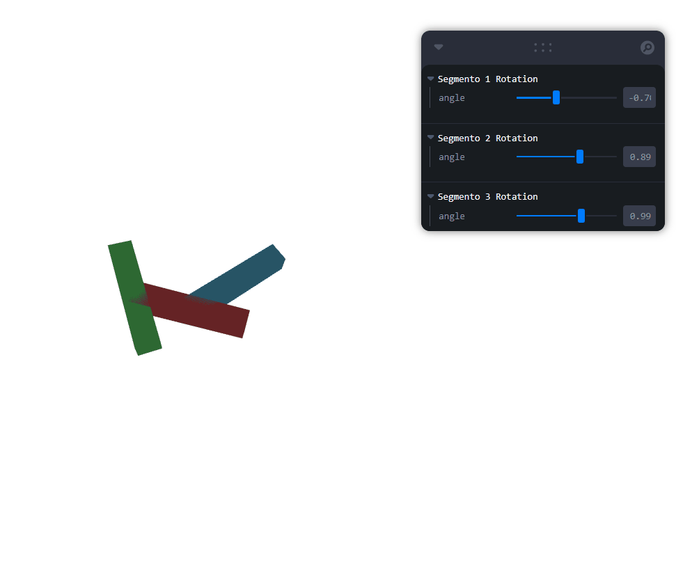

# 🧪  Taller - Cinemática Directa: Animando Brazos Robóticos o Cadenas Articuladas

## 📅 Fecha
`2025-06-24` – Fecha de realización

---

## 🎯 Objetivo del Taller

Explorar y aplicar la creación de una jerarquía de objetos 3D (`<mesh>` dentro de `<group>s`) utilizando Three.js y React Three Fiber para simular un brazo robótico. Se buscó implementar rotaciones jerárquicas controladas por `useFrame()`, visualizar el trazado del movimiento del efector final y permitir el ajuste manual de los ángulos de rotación mediante sliders de `leva`.

---

## 🧠 Conceptos Aprendidos

Lista los principales conceptos aplicados:

- [x] Jerarquía de objetos 3D (padre-hijo) con `<group>` en React Three Fiber.
- [x] Aplicación de transformaciones (rotación) de forma jerárquica.
- [x] Obtención de la posición global de un objeto 3D (`getWorldPosition`).
- [x] Trazado de trayectorias utilizando el componente `Line` de `@react-three/drei`.
- [x] Implementación de interfaz de usuario con `leva` para controlar parámetros 3D.
- [x] Manejo de estado en React para almacenar y actualizar puntos de trayectoria.
- [x] Gestión de la cámara y controles de órbita con `OrbitControls`.

---

## 🔧 Herramientas y Entornos

- React (con Vite/CRA)
- Three.js
- @react-three/fiber
- @react-three/drei
- leva
- Navegador web (Firefox)

---

## 📁 Estructura del Proyecto
```
2025-06-24_taller_cinematica_directa_fk/
├── GIFs/
├── threejs/
├── README.md

```
---

## 🧪 Implementación

Se implementó un brazo robótico con tres segmentos articulados. Cada segmento es un cubo que rota sobre su propio eje Z, y su rotación se suma a la de sus padres, creando un movimiento jerárquico. La posición del extremo final del brazo es rastreada y visualizada como una línea. Los ángulos de rotación de cada segmento pueden ser ajustados en tiempo real a través de sliders de la librería `leva`.

### 🔹 Etapas realizadas
1. Configuración inicial de un proyecto React con `@react-three/fiber` y `@react-three/drei`.
2. Creación del componente `ArmSegment` para representar cada eslabón del brazo, incluyendo su geometría y material.
3. Establecimiento de la jerarquía anidando `ArmSegment`s dentro de otros `ArmSegment`s (que internamente usan `<group>`).
4. Implementación de rotaciones en el eje Z para cada segmento, controladas por un estado y sliders de `leva`.
5. Uso de `useFrame` para aplicar las rotaciones y obtener la posición global del efector final.
6. Desarrollo de la lógica para almacenar las posiciones del efector final y dibujar la trayectoria con el componente `Line`.
7. Ajuste de los colores de cada segmento para una mejor visualización.
8. Configuración de la vista de la cámara y los controles de órbita para una interacción adecuada.
9. Ajuste del `div` contenedor para que la visualización ocupe el 100% del ancho y alto de la pantalla.

### 🔹 Código relevante

```jsx

export default function RobotArm() {
  const [linePoints, setLinePoints] = useState([]);
  const MAX_POINTS = 500;

  const updateEndEffectorPoints = useCallback((position) => {
    setLinePoints((prevPoints) => {
      const newPoints = [...prevPoints, position.clone()];
      if (newPoints.length > MAX_POINTS) {
        newPoints.shift();
      }
      return newPoints;
    });
  }, []);

  useEffect(() => {
    setLinePoints([]);
  }, []);

  return (
    <div style={{ width: '100vw', height: '100vh' }}>
      <Canvas camera={{ position: [3, 3, 3], fov: 75 }}>
        <ambientLight intensity={0.5} />
        <pointLight position={[10, 10, 10]} />
        <OrbitControls />
        <group position={[0, 0, 0]}>
          <ArmSegment position={[0.5, 0, 0]} rotationOffset={0} name="Segmento 1" color={segmentColors[0]}>
            <ArmSegment position={[0.5, 0, 0]} rotationOffset={0} name="Segmento 2" color={segmentColors[1]}>
              <ArmSegment
                position={[0.5, 0, 0]}
                rotationOffset={0}
                name="Segmento 3"
                onUpdateEndEffector={updateEndEffectorPoints}
                color={segmentColors[2]}
              />
            </ArmSegment>
          </ArmSegment>
        </group>
        {linePoints.length > 1 && (
          <Line
            points={linePoints}
            color="hotpink"
            lineWidth={3}
            transparent
            opacity={0.7}
          />
        )}
      </Canvas>
    </div>
  );
}
```
## 📊 Resultados Visuales

El taller produce una visualización interactiva de un brazo robótico de tres eslabones. Cada eslabón tiene un color distintivo (azul cielo, coral claro y verde claro) y puede rotar independientemente mediante sliders de Leva. Una línea rosa traza el camino del extremo del brazo a medida que se mueve, permitiendo visualizar su trayectoria en 3D. La escena ocupa toda la pantalla, y la cámara se ajusta para una vista apropiada del modelo.



---

## 🧩 Prompts Usados

```Plaintext
"Cambia cada eslabón a un color diferente, y haz que la visualizacion ocupe toda la pantalla y la camara tenga un acercamiento apropiado."
"Dame el codigo para controlar la visualización usando sliders de leva."
```
---

## 💬 Reflexión Final

Este taller reforzó significativamente mi comprensión de la jerarquía de objetos en 3D y cómo se manejan las transformaciones (especialmente rotaciones) en un entorno jerárquico con Three.js y React Three Fiber. La interconexión de useFrame para animaciones y la gestión del estado para el trazado de la línea fue particularmente esclarecedora.

La parte más interesante fue ver cómo las rotaciones de los padres afectan a los hijos y cómo la simple adición de leva transforma un modelo estático en una herramienta interactiva para experimentar con la cinemática. La complejidad inicial podría haber residido en asegurar que la posición global del efector final se calculaba correctamente dentro del bucle de useFrame, pero el uso de getWorldPosition lo simplificó.

En futuros proyectos, aplicaría esta comprensión de la jerarquía para modelos más complejos, como personajes articulados o sistemas mecánicos. Mejoraría este proyecto añadiendo cinemática inversa para controlar el brazo por la posición de su extremo, o implementaría diferentes tipos de articulaciones (e.g., rotoides, prismáticas) para simular robots más complejos.

---

## ✅ Checklist de Entrega

- [x] Inicializar proyecto react three fiber en carpeta
- [x] Código limpio y funcional
- [x] GIF incluido con nombre descriptivo (si el taller lo requiere) - Placeholder añadido, necesita generación manual del GIF
- [x] README completo y claro
- [x] Commits descriptivos en inglés