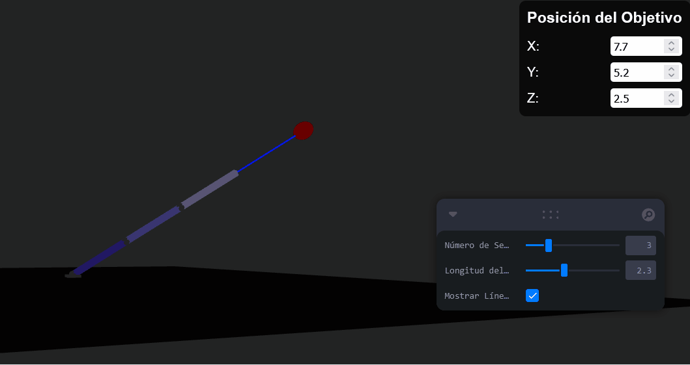

# 🧪 Taller - Cinemática Inversa: Haciendo que el Modelo Persiga Objetivos
## 📅 Fecha
2025-06-24
---
## 🎯 Objetivo del Taller

El objetivo principal de este taller fue aplicar el concepto de cinemática inversa (IK) para simular un brazo robótico 3D que alcanza un punto objetivo dinámico. Se buscó comprender cómo una cadena de articulaciones puede ajustarse automáticamente para alcanzar una posición deseada utilizando algoritmos como el CCD (Cyclic Coordinate Descent), y visualizar este proceso en un entorno web interactivo.

---
## 🧠 Conceptos Aprendidos
* Cinemática Inversa (IK): Comprensión de la diferencia entre cinemática directa (controlar las articulaciones para obtener una posición final) e inversa (definir la posición final y dejar que el sistema calcule las rotaciones de las articulaciones).

* Algoritmo CCD (Cyclic Coordinate Descent): Implementación y aplicación de este algoritmo iterativo para resolver el problema de la cinemática inversa en una cadena de eslabones.

* Referencias (useRef): Utilización de referencias de React para acceder directamente a los objetos 3D subyacentes de Three.js y manipular sus propiedades.

* Hooks de React Three Fiber (useFrame): Ejecución de lógica de simulación y actualización de la escena en cada fotograma del ciclo de renderizado.

* Vectores y Cuaterniones (Three.js): Manipulación de conceptos matemáticos clave como Vector3 para posiciones y direcciones, y Quaternion para rotaciones, fundamentales en gráficos 3D y cinemática.

* Transformaciones Jerárquicas: Comprensión de cómo las transformaciones (posición, rotación) de los grupos padres afectan a sus hijos, crucial para la estructura de un brazo robótico.
---
## 🔧 Herramientas y Entornos
Entornos:

* JavaScript (React)

* Node.js (para la gestión de paquetes)

* Librerías:

* three (Three.js)

* @react-three/fiber

* @react-three/drei

* leva

## 📁 Estructura del Proyecto
```
2025-06-24_taller_cinematica_inversa_ik/
├── GIFs/
├── threejs/
├── README.md

```
## 🧪 Implementación
###🔹 Etapas realizadas
Configuración Inicial: Se estableció un proyecto de React con las dependencias three, @react-three/fiber, @react-three/drei, y leva.

Estructura del Brazo: Se creó un componente Segment que representa cada eslabón del brazo, incluyendo una esfera visible como articulación y un boxGeometry para el cuerpo del eslabón. Estos segmentos se anidan jerárquicamente para formar el brazo.

Gestión de Referencias: Se implementó un sistema para recolectar referencias a cada group de los segmentos (segmentRefs) utilizando useMemo y useCallback, permitiendo al algoritmo IK acceder y modificar directamente sus propiedades de transformación.

Definición del Objetivo: Se añadió una esfera roja en la escena que actúa como el objetivo del brazo. Su posición es controlada dinámicamente a través de sliders en el panel de leva (X, Y, Z).

Implementación del Solver CCD: Se desarrolló la función solveIK_CCD. Esta función opera de forma iterativa, recorriendo los segmentos desde el efector final hacia la base. En cada articulación, calcula el ángulo y el eje de rotación necesarios para acercar el efector al objetivo, aplicando estas rotaciones al cuaternión del segmento.

Actualización en Bucle (useFrame): Se integró el solveIK_CCD dentro del hook useFrame de React Three Fiber. Esto asegura que en cada fotograma, el brazo recalcule sus rotaciones para perseguir la posición actual del objetivo, creando una animación fluida y reactiva.

Visualización: Se mantuvo una línea (<Line>) que conecta la base del brazo con el objetivo, facilitando la visualización de la dirección deseada por el brazo. La cámara inicial se ajustó para una mejor visibilidad del brazo y el objetivo desde el inicio.

###🔹 Código relevante
El corazón del taller reside en la función solveIK_CCD y su integración en el useFrame de ArmIKScene.
```
// Solver CCD (Cyclic Coordinate Descent) para cinemática inversa
const solveIK_CCD = (segments, target, iterations = 50, tolerance = 0.01) => {
  if (!segments || segments.length === 0) return;

  const effectorWorldPos = new THREE.Vector3();
  const targetWorldPos = new THREE.Vector3();

  target.getWorldPosition(targetWorldPos);

  for (let i = 0; i < iterations; i++) {
    segments[segments.length - 1].getWorldPosition(effectorWorldPos);

    if (effectorWorldPos.distanceTo(targetWorldPos) < tolerance) {
      break;
    }

    for (let j = segments.length - 2; j >= 0; j--) {
      const segment = segments[j];
      if (!segment) continue;

      const jointWorldPos = new THREE.Vector3();
      segment.getWorldPosition(jointWorldPos);

      segments[segments.length - 1].getWorldPosition(effectorWorldPos);
      target.getWorldPosition(targetWorldPos);

      const toEffector = effectorWorldPos.clone().sub(jointWorldPos).normalize();
      const toTarget = targetWorldPos.clone().sub(jointWorldPos).normalize();

      const axis = new THREE.Vector3().crossVectors(toEffector, toTarget).normalize();
      const angle = Math.acos(toEffector.dot(toTarget));

      if (isNaN(angle) || angle < 0.001) continue;

      const rotationQuaternion = new THREE.Quaternion().setFromAxisAngle(axis, angle);
      segment.quaternion.premultiply(rotationQuaternion);
      segment.updateMatrixWorld(true);
    }
  }
};

// ... dentro de ArmIKScene
useFrame(() => {
  if (armRef.current && targetRef.current && segmentRefs.every(ref => ref !== null)) {
    targetRef.current.position.set(targetX, targetY, targetZ);
    solveIK_CCD(segmentRefs, targetRef.current);
  }
});
```
---
## 📊 Resultados Visuales
El resultado visual es un brazo robótico 3D, compuesto por segmentos de colores variados y articulaciones esféricas grises, que se extiende desde una base fija. Una esfera roja, controlable a través de los parámetros X, Y y Z en el panel de Leva, representa el objetivo. El brazo ajusta automáticamente la rotación de sus articulaciones para que el extremo de su "mano" intente alcanzar esta esfera roja. Una línea azul conecta la base del brazo con el objetivo, mostrando la dirección a seguir. La escena ocupa toda la pantalla, ofreciendo una vista inmersiva del comportamiento del brazo.



---
## 💬 Reflexión Final
Este taller ha sido una excelente oportunidad para profundizar en los principios de la cinemática inversa y su aplicación práctica en un entorno 3D interactivo. Reforcé mi comprensión sobre cómo los algoritmos iterativos, como el CCD, pueden resolver problemas complejos de movimiento robótico de manera elegante, traduciendo una posición deseada del efector final en las rotaciones articulares correspondientes.

La parte más interesante fue, sin duda, ver el brazo ajustarse en tiempo real a medida que se modificaba la posición del objetivo a través de los controles de Leva. La interactividad y la visualización directa del algoritmo trabajando fueron muy gratificantes. La complejidad radicó inicialmente en asegurar la correcta gestión de las referencias de los segmentos en React y en la propagación de las transformaciones en la jerarquía de Three.js, pero una vez comprendido, el flujo de datos se volvió claro.

En futuros proyectos, definitivamente aplicaría la cinemática inversa para animaciones de personajes, simulaciones de robots industriales o incluso herramientas de modelado 3D donde la manipulación intuitiva de objetos es clave. Mejoraría la robustez del solver IK para manejar casos límite, como el alcance máximo del brazo o las restricciones angulares de las articulaciones, y exploraría otros algoritmos como FABRIK para comparar su rendimiento y estabilidad.

## ✅ Checklist de Entrega
- [x] Creación del proyecto de React en la carpeta

- [x] Código limpio y funcional

- [X] GIF incluido con el resultado de la visualización

- [x] Visualizaciones o métricas exportadas

- [x] README completo y claro

- [x] Commits descriptivos