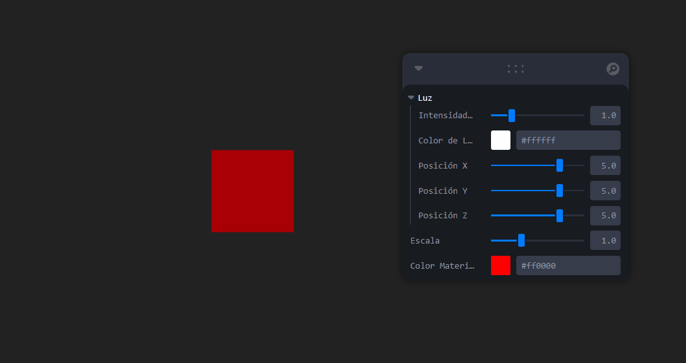

# 🧪 Taller - Dashboards Visuales 3D: Sliders y Botones para Controlar Escenas
## 📅 Fecha

2025-06-24 – Fecha de entrega o realización
---
## 🎯 Objetivo del Taller

Crear interfaces gráficas 3D interactivas que permitan al usuario controlar elementos de una escena, como transformaciones, colores o luces. El propósito es construir paneles funcionales y visuales que conecten entradas de usuario (sliders, botones) con la modificación en tiempo real de objetos 3D en un entorno Three.js con React Three Fiber.
---
## 🧠 Conceptos Aprendidos

React Three Fiber: Integración de Three.js con React para crear escenas 3D declarativamente.

Leva: Herramienta para crear interfaces de usuario interactivas (dashboards) que permiten controlar propiedades de la escena 3D en tiempo real.

useControls(): Hook de Leva para definir y gestionar los controles de la interfaz.

useRef(): Hook de React para acceder a elementos DOM o a referencias de objetos Three.js.

useFrame(): Hook de React Three Fiber para ejecutar lógica por cada frame de renderizado, ideal para animaciones.
Estados en React (useState): Gestión del estado de la aplicación, como la rotación automática del objeto.
Conceptos básicos de Three.js: Geometrías (BoxGeometry), materiales (MeshStandardMaterial), luces (AmbientLight, DirectionalLight).
OrbitControls de drei: Componente que facilita la navegación por la escena 3D (pan, zoom, rotación).
---
## 🔧 Herramientas y Entornos

* Entorno de Desarrollo: Node.js, npm/yarn
* Framework: React
* Librerías 3D: Three.js, @react-three/fiber, @react-three/drei
* UI de Controles: Leva
---
## 📁 Estructura del Proyecto

```
2025-06-24_taller_dashboards_visuales_3d_sliders_botones/
├── GIFs/
├── threejs/
├── README.md
```
---

## 🧪 Implementación
El proyecto se implementó como una aplicación React utilizando create-react-app. La escena 3D se configuró con react-three-fiber y los controles interactivos se crearon con leva.
### 🔹 Etapas realizadas
Configuración inicial del proyecto React: Creación del proyecto con create-react-app y instalación de las dependencias (three, @react-three/fiber, @react-three/drei, leva).

Creación del componente MyBox: Un componente funcional de React que encapsula la lógica del objeto 3D (un cubo).
Implementación de controles con Leva para MyBox:
* Un slider para controlar la escala (scale) del cubo.
* Un slider de color para el material (color) del cubo.
* Un botón que activa/desactiva la rotación automática del cubo. Se implementó como una función directa para robustez con Leva.
* Animación de rotación: Uso del hook useFrame dentro de MyBox para aplicar la rotación cuando autoRotate es true.

Configuración de la escena en App.js:
* Creación del Canvas de react-three-fiber.
* Adición de AmbientLight y DirectionalLight.
* Bonus - Controles de luz con Leva: Se agregaron sliders para controlar la intensidad, el color y la posición de la luz direccional.
* Inclusión del componente MyBox.
* Adición de OrbitControls para permitir la interacción con la cámara de la escena.
* Estilizado básico: Se aplicó un estilo minimalista para que el canvas ocupe toda la pantalla.

### 🔹 Código relevante
```
// src/App.js - Fragmento central que muestra la integración de Leva y React Three Fiber
import React, { useRef, useState } from 'react';
import { Canvas, useFrame } from '@react-three/fiber';
import { OrbitControls } from '@react-three/drei';
import { useControls } from 'leva';

function MyBox() {
  const meshRef = useRef();
  const [autoRotate, setAutoRotate] = useState(false);

  const { scale, color } = useControls({
    scale: { value: 1, min: 0.1, max: 3, step: 0.1, label: 'Escala' },
    color: { value: '#ff0000', label: 'Color Material' },
    'Rotación Automática': () => setAutoRotate((prev) => !prev),
  });

  useFrame(() => {
    if (meshRef.current && autoRotate) {
      meshRef.current.rotation.x += 0.01;
      meshRef.current.rotation.y += 0.01;
    }
  });

  return (
    <mesh ref={meshRef} scale={[scale, scale, scale]}>
      <boxGeometry args={[1, 1, 1]} />
      <meshStandardMaterial color={color} />
    </mesh>
  );
}

export default function App() {
  const { lightIntensity, lightColor, lightPositionX, lightPositionY, lightPositionZ } = useControls('Luz', {
    lightIntensity: { value: 1, min: 0, max: 5, step: 0.1, label: 'Intensidad de Luz' },
    lightColor: { value: '#ffffff', label: 'Color de Luz' },
    lightPositionX: { value: 5, min: -10, max: 10, step: 0.1, label: 'Posición X' },
    lightPositionY: { value: 5, min: -10, max: 10, step: 0.1, label: 'Posición Y' },
    lightPositionZ: { value: 5, min: -10, max: 10, step: 0.1, label: 'Posición Z' },
  });

  return (
    <div style={{ height: '100vh', width: '100vw', background: '#222' }}>
      <Canvas camera={{ position: [0, 0, 5], fov: 75 }}>
        <ambientLight intensity={0.5} />
        <directionalLight
          position={[lightPositionX, lightPositionY, lightPositionZ]}
          intensity={lightIntensity}
          color={lightColor}
        />
        <MyBox />
        <OrbitControls />
      </Canvas>
    </div>
  );
}
```
---

## 📊 Resultados Visuales

El resultado es una aplicación web interactiva que muestra un cubo 3D. En la esquina superior derecha de la ventana, aparece un panel de control generado por Leva. Este panel permite al usuario:
* Ajustar el tamaño del cubo utilizando un slider de "Escala".
* Cambiar el color del material del cubo con un selector de color "Color Material".
* Activar o desactivar la rotación automática del cubo con un botón "Rotación Automática".
* Modificar la intensidad, el color y la posición de la luz direccional que ilumina la escena a través de un panel de "Luz" separado.
* Los controles de órbita permiten al usuario mover y hacer zoom alrededor del cubo con el ratón.


---

## 💬 Reflexión Final

Este taller ha sido una excelente oportunidad para reforzar el conocimiento sobre la integración de Three.js con React a través de React Three Fiber, una combinación muy potente para el desarrollo de experiencias 3D en la web. La parte más compleja, pero también la más interesante, fue la integración de Leva para crear una interfaz de usuario interactiva y fluida que controlara en tiempo real las propiedades de los objetos 3D y las luces. Superar el error Plugins[type] is undefined con Leva, entendiendo cómo esta librería interpreta los diferentes tipos de controles (especialmente los botones como funciones), fue un aprendizaje clave.
En futuros proyectos, definitivamente aplicaría esta combinación de tecnologías para crear dashboards interactivos y visualizaciones de datos en 3D, ya que permite una gran flexibilidad y un desarrollo ágil. Además, exploraría la creación de más tipos de controles personalizados con Leva y la integración de modelos 3D más complejos para enriquecer las escenas.
---
## ✅ Checklist de Entrega

- [x] Inicializar proyecto react three fiber en carpeta
- [x] Código limpio y funcional (App.js)
- [x] GIF incluido con nombre descriptivo
- [x] README completo y claro
- [x] Commits descriptivos
