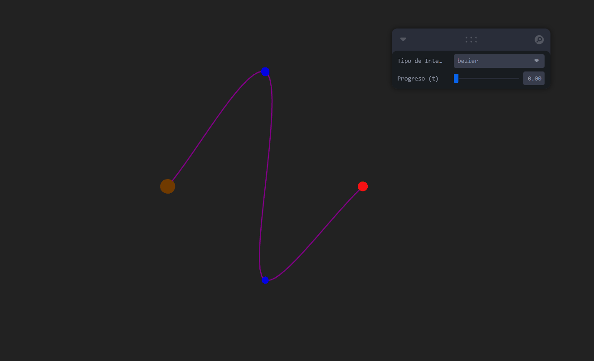

# 🧪 Taller - Interpolación de Movimiento: Suavizando Animaciones en Tiempo Real

## 📅 Fecha
`2025-06-24` – Fecha de entrega o realización

---

## 🎯 Objetivo del Taller

Implementar técnicas de interpolación (LERP, SLERP, Bézier) para crear animaciones suaves y naturales en objetos 3D. El objetivo es controlar el paso del tiempo y la transición entre estados con efectos realistas como aceleración, desaceleración o movimientos curvos. Esto se logra creando una escena con un `<mesh>` y puntos de inicio/fin visibles, interpolando la posición y rotación, y visualizando una curva de Bézier.

---

## 🧠 Conceptos Aprendidos

Lista los principales conceptos aplicados:

- [x] **Interpolación Lineal (LERP - Linear Interpolation)**: Método para obtener un punto intermedio entre dos valores o vectores, moviéndose a una velocidad constante.
- [x] **Interpolación Esférica Lineal (SLERP - Spherical Linear Interpolation)**: Técnica especializada para interpolar rotaciones entre dos cuaterniones, resultando en un movimiento angular suave y evitando el "Gimbal Lock".
- [x] **Curvas de Bézier (aproximación con Catmull-Rom)**: Utilizadas para definir trayectorias curvas suaves y personalizadas a través de puntos de control.
- [x] **React Three Fiber (`@react-three/fiber`)**: Librería que permite escribir escenas 3D de Three.js con la sintaxis declarativa de React.
- [x] **`@react-three/drei`**: Colección de componentes y utilidades útiles para React Three Fiber (como `OrbitControls`, `Sphere`, `Box`, `Line`).
- [x] **`leva`**: Librería para crear una interfaz gráfica de usuario (GUI) depurable y controlable para variables en tiempo real.
- [x] **`useFrame` (R3F Hook)**: Hook para ejecutar lógica en cada fotograma de la animación.
- [x] **`useRef` (React Hook)**: Para acceder a los objetos 3D del DOM subyacente de Three.js.
- [x] **Cuaterniones (`THREE.Quaternion`)**: Representación de rotaciones que evita el "Gimbal Lock", ideal para SLERP.
- [x] **Vectores (`THREE.Vector3`)**: Utilizados para representar posiciones en el espacio 3D.

---

## 🔧 Herramientas y Entornos

Especifica los entornos usados:

- Entorno de Desarrollo: **Node.js, npm/yarn**
- Framework JavaScript: **React**
- Bundler/Toolchain: **Vite**
- Librerías 3D: **Three.js**
- Renderizador 3D para React: **React Three Fiber (`@react-three/fiber`)**
- Componentes auxiliares para R3F: **`@react-three/drei`**
- Interfaz de Usuario para Controles: **Leva**
- Estilizado: **Tailwind CSS** (para dimensiones del canvas)

---

## 📁 Estructura del Proyecto
```
2025-06-24_taller_interpolacion_movimiento_animaciones/
├── GIFs/
├── threejs/
├── README.md
```

---
## 🧪 Implementación

La implementación se centró en un único archivo `App.tsx` para simplificar el taller y mantener toda la lógica de interpolación centralizada.

### 🔹 Etapas realizadas
1.  **Configuración del Proyecto**: Inicialización de un proyecto React con Vite y configuración de Tailwind CSS para asegurar que el `Canvas` de React Three Fiber ocupe toda la pantalla.
2.  **Definición de Escena 3D**: Creación de un `<Canvas>` con luces y `OrbitControls` para permitir la interacción del usuario.
3.  **Puntos de Inicio y Fin**: Visualización de dos esferas (verde para inicio, roja para fin) que marcan los extremos de las trayectorias de interpolación.
4.  **Componente `AnimatedObject`**: Implementación de un componente reutilizable para un objeto 3D (una caja) que se anima utilizando LERP para posición y tanto LERP como SLERP para rotación. Se utilizan `useRef` para referenciar el mesh y `useFrame` para actualizar su posición/rotación en cada fotograma.
5.  **Componente `BezierPathAndObject`**: Desarrollo de un componente para dibujar una curva de Bézier (aproximada con `CatmullRomCurve3`) y animar un objeto a lo largo de esta curva. También se visualizan los puntos de control de la curva.
6.  **Interfaz de Usuario con Leva**: Integración de `leva` para proporcionar controles interactivos (`t` para el progreso de la animación y un selector para el `interpolationType`) permitiendo al usuario cambiar dinámicamente entre las diferentes técnicas de interpolación.
7.  **Renderizado Condicional**: Uso de lógica condicional para renderizar el `AnimatedObject` (para LERP/SLERP) o el `BezierPathAndObject` según el tipo de interpolación seleccionado en la UI.
8.  **Depuración y Refactorización**: Corrección de errores comunes como la necesidad de importar `React` en versiones modernas y el uso incorrecto de `useRef` para elementos no adjuntos.

### 🔹 Código relevante

El corazón del taller reside en el archivo `src/App.tsx`, donde se definen los componentes `AnimatedObject` y `BezierPathAndObject`, y se orquestra la escena 3D:

```tsx

// ... (AnimatedObject y BezierPathAndObject componentes definidos aquí, como en el código final compartido)

function App() {
  const startPos: [number, number, number] = [-2, 0, 0];
  const endPos: [number, number, number] = [2, 0, 0];
  const startRot = new Vector3(0, 0, 0);
  const endRot = new Vector3(0, Math.PI, 0);
  const controlPoint1: [number, number, number] = [0, 2, -1];
  const controlPoint2: [number, number, number] = [0, -2, 1];

  const { interpolationType, t } = useControls({
    interpolationType: { value: 'lerp', options: ['lerp', 'slerp-position', 'bezier'], label: 'Tipo de Interpolación' },
    t: { value: 0, min: 0, max: 1, step: 0.01, label: 'Progreso (t)' },
  });

  return (
    <Canvas className="w-full h-screen" camera={{ position: [0, 5, 5], fov: 60 }}>
      <ambientLight intensity={0.5} />
      <pointLight position={[10, 10, 10]} />
      <Sphere position={startPos} args={[0.1, 16, 16]}><meshBasicMaterial color="green" /></Sphere>
      <Sphere position={endPos} args={[0.1, 16, 16]}><meshBasicMaterial color="red" /></Sphere>

      {interpolationType !== 'bezier' ? (
        <AnimatedObject
          startPosition={startPos} endPosition={endPos}
          startRotation={startRot} endRotation={endRot}
          t={t} interpolationType={interpolationType}
        />
      ) : (
        <>
          <BezierPathAndObject
            startPoint={new Vector3(...startPos)}
            controlPoint1={new Vector3(...controlPoint1)}
            controlPoint2={new Vector3(...controlPoint2)}
            endPoint={new Vector3(...endPos)}
            t={t}
          />
          <Sphere position={controlPoint1} args={[0.08, 16, 16]}><meshBasicMaterial color="blue" /></Sphere>
          <Sphere position={controlPoint2} args={[0.08, 16, 16]}><meshBasicMaterial color="blue" /></Sphere>
        </>
      )}
      <OrbitControls />
    </Canvas>
  );
}

```

---
## 📊 Resultados Visuales
La aplicación muestra una escena 3D donde un objeto (un cubo o una esfera, según el tipo de interpolación) se mueve entre dos puntos marcados por esferas (verde y roja). Un panel de control en la esquina superior derecha (Leva) permite al usuario ajustar el progreso de la animación (t) y seleccionar el tipo de interpolación.

Al seleccionar "lerp", el objeto se mueve en línea recta. Al seleccionar "slerp-position", el objeto también se mueve en línea recta en posición, pero su rotación es más suave y directa. Cuando se selecciona "bezier", se visualiza una curva púrpura y el objeto se mueve a lo largo de esa curva, mostrando un movimiento no lineal influenciado por los puntos de control azules.



---
## 💬 Reflexión Final
Este taller ha sido fundamental para comprender la importancia de las diferentes técnicas de interpolación en la creación de animaciones 3D. Reforcé mi conocimiento sobre cómo LERP proporciona un movimiento lineal y predecible, mientras que SLERP es indispensable para rotaciones naturales, evitando artefactos como el "Gimbal Lock". La exploración de las curvas de Bézier (o su aproximación con Catmull-Rom) fue particularmente interesante, ya que abrió la puerta a la creación de trayectorias de movimiento mucho más complejas y orgánicas, lo cual es crucial para dar vida y realismo a las animaciones.

La parte más compleja fue, sin duda, la depuración inicial relacionada con la configuración del entorno, especialmente con la integración de Tailwind CSS y la comprensión de los cambios en la importación de React en entornos modernos de desarrollo. Sin embargo, esto también fue lo más interesante, ya que me permitió profundizar en cómo funcionan estas herramientas en conjunto. La simplicidad de Leva para añadir controles en tiempo real fue una grata sorpresa y demostró ser extremadamente útil para experimentar con los parámetros de interpolación de forma interactiva.

En futuros proyectos, definitivamente aplicaría la interpolación SLERP para cualquier rotación de objetos, priorizando siempre la calidad del movimiento. Además, la capacidad de definir trayectorias con curvas de Bézier es una herramienta poderosa para animaciones complejas, y buscaría profundizar en la implementación de curvas de Bézier cúbicas puras si la precisión es crítica. Mejoraría la interactividad añadiendo la posibilidad de arrastrar los puntos de control de la curva en la propia escena 3D para una experiencia de usuario más intuitiva, y exploraría más opciones de suavizado como funciones de ease-in/ease-out.

---
## ✅ Checklist de Entrega
- [x] Inicializar proyecto de react en carpeta
- [x] Código limpio y funcional
- [x] GIF resultado visual incluido
- [x] README completo y claro
- [x] Commits descriptivos