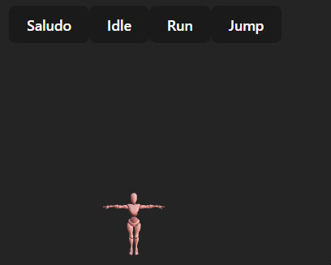

# 🧪 Taller - Motion Design Interactivo: Acciones Visuales según Eventos del Usuario

## 🔍 Objetivo del taller

Crear animaciones reactivas donde un **modelo 3D animado (proveniente de Mixamo)** responde a eventos del usuario, como clics, teclas o movimientos del cursor. El objetivo es introducir los fundamentos del motion design aplicado a personajes, integrando eventos y lógica de interacción con animaciones esqueléticas.

---

## 🧠 Conceptos Aprendidos

- Carga y visualización de modelos 3D animados en formato GLTF.
- Control de animaciones mediante eventos y UI en React.
- Uso de React Three Fiber y Drei para renderizado 3D interactivo en la web.
- Implementación de botones y controles para cambiar animaciones en tiempo real.
- Organización modular de componentes para escenas interactivas.
- Documentación y estructuración de proyectos de motion design interactivo.

---

## 🔧 Herramientas y Entornos

- **React Three Fiber** (`@react-three/fiber`, `@react-three/drei`)
- **Three.js** (motor 3D subyacente)
- **React** y **Vite** para desarrollo rápido y recarga en caliente
- **GLTF** para modelos 3D animados
- **react-spring** para animaciones adicionales (opcional)
- **ESLint** para control de calidad de código

---

## 📁 Estructura del Proyecto

```
threejs/
└── motion-design-interactivo/
    ├── .gitignore
    ├── eslint.config.js
    ├── index.html
    ├── package.json
    ├── vite.config.js
    ├── README.md
    ├── public/
    │   └── models/
    │       ├── result.gltf
    │       └── result.bin
    └── src/
        ├── App.css
        ├── App.jsx
        ├── index.css
        ├── index.jsx
        ├── main.jsx
        └── components/
            ├── AnimatedModel.jsx
            └── AnimationControls.jsx
```

---

## 🧪 Implementación

### 🔹 Etapas realizadas por tecnología

#### React Three Fiber

1. **Carga de modelo 3D animado** en formato GLTF usando Drei (`useGLTF`).
2. **Implementación de controles de animación** mediante botones en la UI (`AnimationControls.jsx`).
3. **Gestión de animaciones** con el hook `useAnimations` para cambiar entre clips (Idle, Run, Jump, Saludo).
4. **Renderizado de la escena 3D** con luces, entorno y controles de cámara (`OrbitControls`, `Environment`).
5. **Organización modular** de componentes para separar lógica de animación y UI.
6. **Estilización básica** para centrar el canvas y los controles.

---

### 🔹 Código relevante

#### Componente principal de la app ([`App.jsx`](threejs/motion-design-interactivo/src/App.jsx)):

```jsx
import React, { useState } from "react";
import { Canvas } from "@react-three/fiber";
import { OrbitControls, Environment } from "@react-three/drei";
import AnimatedModel from "./components/AnimatedModel";
import AnimationControls from "./components/AnimationControls";

function App() {
  const [currentAnimation, setCurrentAnimation] = useState("Idle");

  const changeAnimation = (animation) => {
    setCurrentAnimation(animation);
  };

  return (
    <>
      <AnimationControls changeAnimation={changeAnimation} />
      <Canvas camera={{ position: [0, 2, 5], fov: 50 }}>
        <ambientLight intensity={0.4} />
        <directionalLight position={[10, 10, 5]} intensity={1.2} />
        <Environment preset="sunset" />
        <AnimatedModel currentAnimation={currentAnimation} />
        <OrbitControls />
      </Canvas>
    </>
  );
}

export default App;
```

#### Componente de modelo animado ([`AnimatedModel.jsx`](threejs/motion-design-interactivo/src/components/AnimatedModel.jsx)):

```jsx
import { useEffect, useRef } from "react";
import { useGLTF, useAnimations } from "@react-three/drei";

const AnimatedModel = ({ currentAnimation }) => {
  const { scene, animations } = useGLTF("/models/result.gltf");
  const { actions } = useAnimations(animations, scene);
  const group = useRef();

  useEffect(() => {
    if (actions[currentAnimation]) {
      actions[currentAnimation].reset().fadeIn(0.2).play();
    }
    return () => {
      if (actions[currentAnimation])
        actions[currentAnimation].fadeOut(0.2).stop();
    };
  }, [currentAnimation, actions]);

  return (
    <group ref={group}>
      <primitive object={scene} />
    </group>
  );
};

export default AnimatedModel;
```

#### Componente de controles de animación ([`AnimationControls.jsx`](threejs/motion-design-interactivo/src/components/AnimationControls.jsx)):

```jsx
import React from "react";

const AnimationControls = ({ changeAnimation }) => (
  <div style={{ position: "absolute", top: "10px", left: "10px", zIndex: 10 }}>
    <button onClick={() => changeAnimation("Saludo")}>Saludo</button>
    <button onClick={() => changeAnimation("Idle")}>Idle</button>
    <button onClick={() => changeAnimation("Run")}>Run</button>
    <button onClick={() => changeAnimation("Jump")}>Jump</button>
  </div>
);

export default AnimationControls;
```

---

## 📊 Resultados Visuales

A continuación se muestran ejemplos de la visualización interactiva y el cambio de animaciones en tiempo real.

### Escena 3D interactiva

- El usuario puede rotar la cámara y cambiar la animación del modelo 3D usando los botones de la interfaz.
- El modelo responde inmediatamente a los eventos, mostrando la animación seleccionada.



---

## 🧩 Prompts Usados

```text
"¿Cómo cargo y reproduzco animaciones de un modelo GLTF en React Three Fiber?"
"¿Cómo cambio la animación activa de un modelo GLTF desde la UI?"
"¿Cómo organizo componentes para separar controles y lógica de animación en React?"
"¿Cómo sincronizo eventos de usuario con animaciones en Three.js?"
```

---

## 💬 Reflexión Final

Este taller permitió comprender cómo integrar modelos animados y controlar sus animaciones de manera interactiva en la web. La separación de componentes y el uso de hooks de Drei facilitaron la gestión de animaciones y la respuesta a eventos de usuario. El mayor reto fue asegurar la transición suave entre animaciones y la correcta carga del modelo GLTF. Para futuros proyectos, sería interesante añadir transiciones más avanzadas, integración de eventos personalizados y la posibilidad de cargar modelos externos de
