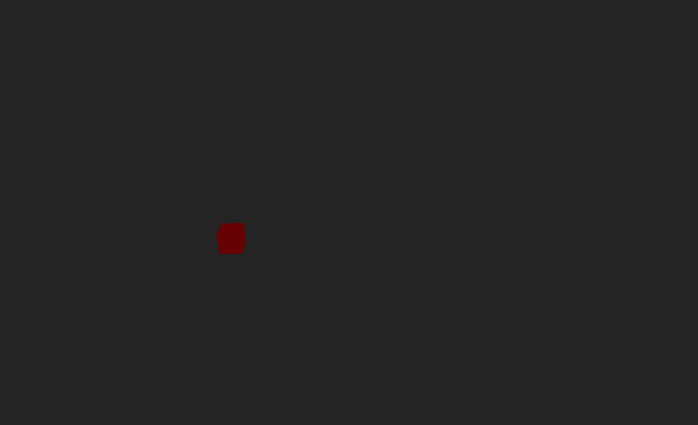

# 🧪 Taller de WebSockets e Interacción Visual en Tiempo Real

## 📅 Fecha
2025-06-24 – Fecha de realización

---

## 🎯 Objetivo del Taller

Comprender cómo usar WebSockets para habilitar comunicación en tiempo real entre un cliente (interfaz visual) y un servidor. El objetivo es crear una visualización gráfica que reaccione dinámicamente a datos transmitidos por WebSocket, en este caso, un objeto 3D (cubo) que cambia su posición y color.

---

## 🧠 Conceptos Aprendidos

Lista los principales conceptos aplicados:

- [x] WebSockets: Diferencias con HTTP tradicional y uso para comunicación bidireccional en tiempo real.
- [x] `websockets` (Python): Creación de un servidor WebSocket.
- [x] `asyncio` (Python): Manejo de operaciones asíncronas para el servidor.
- [x] React: Desarrollo de interfaz de usuario con componentes.
- [x] Three.js: Creación de escenas y objetos 3D.
- [x] `@react-three/fiber`: Integración de Three.js con React.
- [x] `@react-three/drei`: Uso de componentes auxiliares como `OrbitControls`.
- [x] Manejo de estado en React (`useState`, `useEffect`).
- [x] Referencias en React (`useRef`) para manipular objetos 3D directamente.
- [x] Renderizado por frame con `useFrame`.

---

## 🔧 Herramientas y Entornos

Especifica los entornos usados:

- **Servidor:** Python 3.x
    - Librería: `websockets`
- **Cliente:** Navegador web
    - Framework: React (con Vite)
    - Librerías 3D: `three`, `@react-three/fiber`, `@react-three/drei`
    - Gestor de paquetes: npm

---

## 📁 Estructura del Proyecto
```
2025-06-24_taller_websockets_interaccion_visual/
├── GIFs/
├── threejs/
├── python/
├── README.md
```
---

## 🧪 Implementación

### 🔹 Etapas realizadas
1.  **Configuración del entorno Python:** Creación de un entorno virtual e instalación de la librería `websockets`.
2.  **Desarrollo del servidor WebSocket en Python (`server.py`):** Se creó un script Python que genera coordenadas (x, y) aleatorias y un color ("red", "green", "blue") cada 0.5 segundos, enviándolos como un objeto JSON a través de una conexión WebSocket.
3.  **Configuración del entorno React con Vite:** Creación de un nuevo proyecto React (con JSX) e instalación de las dependencias `three`, `@react-three/fiber`, y `@react-three/drei`.
4.  **Desarrollo del cliente web en React (`App.jsx`):**
    * Se estableció una conexión WebSocket a `ws://localhost:8765`.
    * Se utilizó `useEffect` para manejar el ciclo de vida de la conexión WebSocket (abrir, recibir mensajes, cerrar).
    * Los datos JSON recibidos (`x`, `y`, `color`) se parsean y se almacenan en el estado del componente.
    * Se usó un componente `<Canvas>` de `@react-three/fiber` para renderizar la escena 3D.
    * Dentro del Canvas, se definió un componente `Box` que utiliza `useRef` para acceder al objeto 3D y `useFrame` para actualizar su posición y color en cada frame de renderizado basándose en los datos recibidos.
    * Se incluyó `OrbitControls` para permitir la interacción del usuario con la escena 3D.
    * Se ajustó el `Canvas` para que ocupe el 100% del ancho y alto de la ventana, y la cámara se posicionó para una vista inicial prudente del objeto.
5.  **Ejecución y Prueba:** Se inició primero el servidor Python y luego el cliente React para observar la visualización dinámica.

### 🔹 Código relevante

Este fragmento muestra la lógica principal del componente React que se conecta al WebSocket y actualiza el objeto 3D:

```jsx
import React, { useRef, useState, useEffect } from 'react';
import { Canvas, useFrame } from '@react-three/fiber';
import { OrbitControls } from '@react-three/drei';
import * as THREE from 'three';

function Box() {
  const meshRef = useRef();
  const [data, setData] = useState({ x: 0, y: 0, color: 'red' });

  useEffect(() => {
    const socket = new WebSocket("ws://localhost:8765");

    socket.onopen = () => { console.log("Conectado al servidor WebSocket."); };
    socket.onmessage = (event) => {
      const receivedData = JSON.parse(event.data);
      setData(receivedData);
    };
    socket.onclose = () => { console.log("Desconectado del servidor WebSocket."); };
    socket.onerror = (error) => { console.error("Error en WebSocket:", error); };

    return () => { socket.close(); };
  }, []);

  useFrame(() => {
    if (meshRef.current) {
      meshRef.current.position.x = data.x;
      meshRef.current.position.y = data.y;
      let newColor = new THREE.Color(data.color);
      if (meshRef.current.material) {
        meshRef.current.material.color.set(newColor);
      }
    }
  });

  return (
    <mesh ref={meshRef}>
      <boxGeometry args={[1, 1, 1]} />
      <meshStandardMaterial color={data.color} />
    </mesh>
  );
}

function App() {
  return (
    <div style={{ width: '100vw', height: '100vh' }}>
      <Canvas camera={{ position: [0, 0, 5] }}>
        <ambientLight intensity={0.5} />
        <spotLight position={[10, 10, 10]} angle={0.15} penumbra={1} />
        <pointLight position={[-10, -10, -10]} />
        <Box />
        <OrbitControls />
      </Canvas>
    </div>
  );
}

export default App;
```
---
## 📊 Resultados Visuales

El resultado visual es un cubo 3D renderizado en el navegador que ocupa toda la pantalla. Este cubo cambia continuamente su posición en los ejes X e Y, y su color alterna entre rojo, verde y azul, todo en tiempo real, impulsado por los datos recibidos cada 0.5 segundos desde el servidor WebSocket de Python. El usuario puede interactuar con la escena, rotando y haciendo zoom al cubo usando los controles del mouse.



---
## 💬 Reflexión Final
Con este taller, aprendí a integrar de manera efectiva la comunicación en tiempo real con WebSockets entre un backend en Python y un frontend visual en React y Three.js. Reforcé mi comprensión de los WebSockets como un protocolo full-duplex y persistente, contrastándolo con el modelo de solicitud-respuesta de HTTP, y cómo esto es fundamental para aplicaciones que requieren actualizaciones constantes, como la visualización de datos de sensores o escenas interactivas multiusuario.

La parte más interesante fue ver cómo los cambios en el servidor se reflejaban instantáneamente en la visualización 3D en el navegador, creando una experiencia dinámica y fluida. La complejidad inicial podría haber residido en la configuración de los dos entornos distintos (Python y JavaScript) y asegurar que la comunicación entre ellos se estableciera correctamente. El uso de websockets en Python y WebSocket API en JavaScript, junto con la abstracción de React Three Fiber, simplificó enormemente este proceso.

Para futuros proyectos, aplicaría esta arquitectura para construir dashboards de monitoreo en tiempo real, juegos sencillos multiusuario, o incluso interfaces de control para hardware conectado. Mejoraría la resiliencia del WebSocket con lógica de reconexión y añadiría más interactividad al cliente, como controles para iniciar/detener la transmisión de datos desde el servidor o filtros para la visualización.
---
## ✅ Checklist de Entrega
- [x] Inicializar proyecto react three fiber en carpeta
- [x] Código limpio y funcional
- [x] GIF incluido con nombre descriptivo
- [x] README completo y claro
- [x] Commits descriptivos