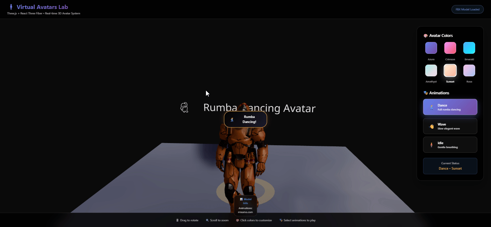

# 🧍‍♂️ Taller 67 - Avatares Virtuales en Unity y Three.js

## 🎯 Objetivo del Taller

Aprender a integrar **avatares 3D** en entornos interactivos usando **Unity** y **Three.js**, permitiendo su visualización, personalización básica, y movimiento mediante entradas del usuario o animaciones predefinidas.

---

## 🧠 Conceptos Aprendidos

- Carga y visualización de modelos FBX animados en Three.js.
- Control de animaciones mediante `useAnimations` y React state.
- Personalización de materiales y colores en tiempo real.
- Implementación de paneles de control interactivos en React.
- Uso de hooks y componentes de React Three Fiber (`Canvas`, `OrbitControls`, `Environment`).
- Organización y documentación de proyectos de computación visual interactiva.

---

## 🔧 Herramientas y Entornos

- **React Three Fiber** (JavaScript, React, Vite)
- **Three.js** para renderizado y animación 3D
- **@react-three/drei** para utilidades y loaders (FBX, controles, entorno)
- **FBX** (modelos animados en `/public/`)
- **CSS** moderno para UI y responsividad

---

## 📁 Estructura del Proyecto

```
2025-06-25_taller_avatares_virtuales/
├── README.md
├── resultados/
│   └── resultado.gif
└── theejs/
    ├── package.json
    └── motion-design-interactivo/
        ├── .gitignore
        ├── eslint.config.js
        ├── index.html
        ├── package.json
        ├── README.md
        ├── vite.config.js
        ├── public/
        │   ├── modelo.fbx
        │   └── modelo2.fbx
        └── src/
            ├── App.css
            ├── App.jsx
            ├── index.css
            ├── main.jsx
            └── components/
                └── AvatarSceneRumba.jsx
```

---

## 🧪 Implementación

### 🔹 Etapas realizadas por tecnología

#### React Three Fiber

1. **Carga del modelo FBX animado** usando `useFBX` y `useAnimations`.
2. **Definición de paneles de control** para personalizar color y animación del avatar.
3. **Aplicación dinámica de color** a los materiales del modelo en tiempo real.
4. **Control de animaciones**: selección entre "Dance", "Wave" e "Idle" con botones interactivos.
5. **Renderizado de la escena 3D** con iluminación avanzada, entorno HDRI y controles de cámara (`OrbitControls`).
6. **UI moderna y responsiva**: panel flotante, barra inferior de tips y overlays de estado.
7. **Componente de carga visual** con animación mientras se importa el modelo.

---

### 🔹 Código relevante

#### Fragmento para cargar y animar el avatar (ver [`AvatarSceneRumba.jsx`](theejs/motion-design-interactivo/src/components/AvatarSceneRumba.jsx)):

```jsx
import React, { useRef, useEffect, useState, Suspense } from "react";
import { useFrame } from "@react-three/fiber";
import { useFBX, useAnimations, Text, Html } from "@react-three/drei";

function AvatarScene({ selectedColor, animationName }) {
  return (
    <group>
      <Text position={[0, 3, 0]} fontSize={0.4} color="white">
        🕺 Rumba Dancing Avatar
      </Text>
      <Suspense fallback={<LoadingAvatar selectedColor={selectedColor} />}>
        <RumbaDancingAvatar
          selectedColor={selectedColor}
          animationName={animationName}
        />
      </Suspense>
    </group>
  );
}

function RumbaDancingAvatar({ selectedColor, animationName }) {
  const group = useRef();
  const [isPlaying, setIsPlaying] = useState(false);
  const fbx = useFBX("/modelo2.fbx");
  const { actions, names } = useAnimations(fbx.animations, group);

  useEffect(() => {
    if (fbx) {
      fbx.traverse((child) => {
        if (child.isMesh && child.material) {
          child.material = child.material.clone();
          if (Array.isArray(child.material)) {
            child.material.forEach((mat) => mat.color?.setStyle(selectedColor));
          } else {
            child.material.color?.setStyle(selectedColor);
          }
        }
      });
    }
  }, [fbx, selectedColor]);

  useEffect(() => {
    if (actions && names.length > 0) {
      Object.values(actions).forEach((action) => action.stop());
      switch (animationName) {
        case "dance":
          actions[names[0]]?.play();
          setIsPlaying(true);
          break;
        case "wave":
          if (actions[names[0]]) {
            actions[names[0]].timeScale = 0.3;
            actions[names[0]].play();
            setIsPlaying(true);
          }
          break;
        case "idle":
          if (actions[names[0]]) {
            actions[names[0]].timeScale = 0.1;
            actions[names[0]].play();
            setIsPlaying(true);
          }
          break;
        default:
          setIsPlaying(false);
      }
    }
  }, [actions, names, animationName]);

  useEffect(() => {
    if (fbx) {
      fbx.scale.set(0.02, 0.02, 0.02);
      fbx.position.set(0, 0, 0);
    }
  }, [fbx]);

  useFrame((state) => {
    if (group.current && !isPlaying) {
      group.current.position.y = Math.sin(state.clock.elapsedTime * 0.5) * 0.1;
    }
  });

  return (
    <group ref={group}>
      <primitive object={fbx} />
      {/* ...ground plane, glow, status overlays... */}
    </group>
  );
}
```

#### Fragmento del panel de control y canvas principal (ver [`App.jsx`](theejs/motion-design-interactivo/src/App.jsx)):

```jsx
import { useState } from "react";
import { Canvas } from "@react-three/fiber";
import { OrbitControls, Environment, Center } from "@react-three/drei";
import AvatarScene from "./components/AvatarSceneRumba";
import "./App.css";

function App() {
  const [selectedColor, setSelectedColor] = useState("#4A90E2");
  const [animationName, setAnimationName] = useState("");

  // ...definición de colores y animaciones...

  return (
    <div>
      {/* Panel de control flotante para color y animación */}
      {/* Canvas 3D con AvatarScene */}
      {/* Barra inferior de tips */}
    </div>
  );
}
```

---

## 📊 Resultados Visuales

Visualización interactiva del avatar 3D personalizado y animado:



---

## 🧩 Prompts Usados

```text
"¿Cómo cargo y animo un modelo FBX en React Three Fiber?"
"¿Cómo cambio el color de un modelo 3D en tiempo real?"
"¿Cómo implemento un panel de control para animaciones y materiales?"
"¿Cómo muestro un loader mientras se importa un modelo FBX?"
"¿Cómo organizo una escena 3D con controles modernos en React?"
```

---

## 💬 Reflexión Final

Este taller permitió experimentar con la integración de modelos animados en 3D y la personalización en tiempo real de sus materiales y animaciones. La combinación de React Three Fiber y Drei facilitó la gestión de la escena y la UI, permitiendo una experiencia interactiva moderna y fluida. El mayor reto fue coordinar la manipulación de materiales y el control de animaciones en modelos FBX complejos. Para futuros proyectos, sería interesante agregar soporte para múltiples avatares, animaciones sincronizadas y personalización avanzada de accesorios o texturas.

---
