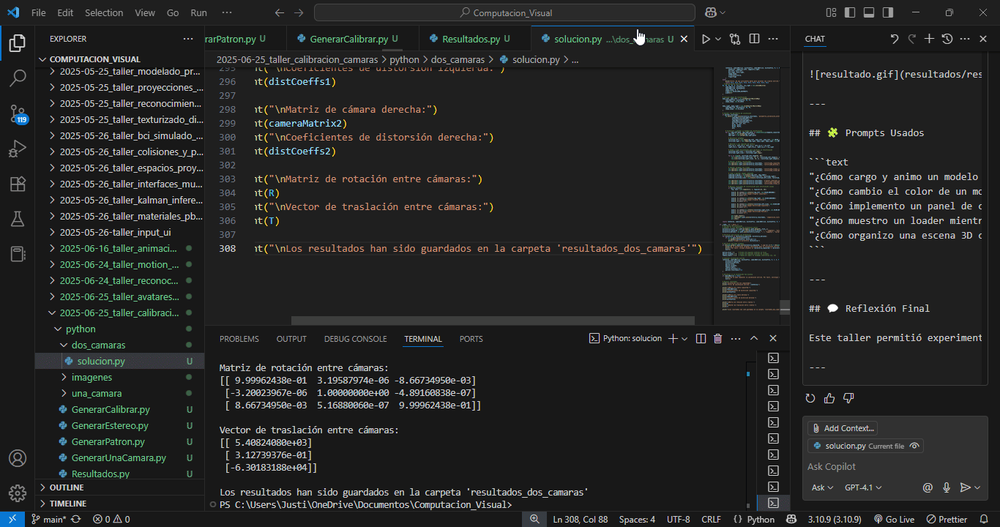

# 📷 Taller 68 - Calibración de Cámaras (una y dos cámaras) con Python

## 🎯 Objetivo del Taller

Aprender los fundamentos de la **calibración de cámaras** en visión por computador, utilizando imágenes de patrones conocidos para obtener los parámetros intrínsecos y extrínsecos de una o dos cámaras.

Este proceso es esencial para tareas como reconstrucción 3D, estimación de profundidad, visión estéreo o realidad aumentada.

---

## 🧠 Conceptos Aprendidos

- Generación de patrones de calibración y simulación de imágenes sintéticas.
- Calibración de una cámara usando imágenes de un patrón de ajedrez.
- Calibración estéreo de dos cámaras y obtención de parámetros de rotación y traslación.
- Corrección de distorsión y visualización de resultados.
- Rectificación de imágenes estéreo y verificación visual de líneas epipolares.
- Organización y documentación de proyectos de visión computacional.

---

## 🔧 Herramientas y Entornos

- **Python** (OpenCV, NumPy, Matplotlib)
- **OpenCV** para calibración, generación y procesamiento de imágenes.
- **Jupyter Notebook** o scripts Python para experimentación y visualización.
- **Estructura modular** para separar generación, calibración y visualización de resultados.

---

## 📁 Estructura del Proyecto

```
2025-06-25_taller_calibracion_camaras/
├── README.md
├── python/
│   ├── GenerarCalibrar.py
│   ├── GenerarEstereo.py
│   ├── GenerarPatron.py
│   ├── GenerarUnaCamara.py
│   ├── Resultados.py
│   ├── dos_camaras/
│   │   └── solucion.py
│   ├── una_camara/
│   │   └── solucion.py
│   └── imagenes/
│       ├── patron_ajedrez.jpg
│       ├── calibracion_estereo/
│       │   ├── derecha/
│       │   │   └── ...
│       │   └── izquierda/
│       │       └── ...
│       └── calibracion_una_camara/
│           ├── calibracion_01.jpg
│           ├── calibracion_02.jpg
│           └── ...
├── resultados_dos_camaras/
│   └── ... (imágenes y parámetros de calibración estéreo)
├── resultados_una_camara/
│   └── ... (imágenes y parámetros de calibración de una cámara)
```

---

## 🧪 Implementación

### 🔹 Etapas realizadas por tecnología

#### Python

1. **Generación de patrón de ajedrez**: Creación automática de un patrón imprimible para calibración ([`GenerarPatron.py`](python/GenerarPatron.py)).
2. **Generación de imágenes sintéticas**: Simulación de vistas del patrón desde diferentes ángulos y posiciones para una cámara y para dos cámaras estéreo ([`GenerarUnaCamara.py`](python/GenerarUnaCamara.py), [`GenerarEstereo.py`](python/GenerarEstereo.py)).
3. **Calibración de una cámara**: Detección de esquinas, cálculo de matriz de cámara y distorsión, corrección y visualización ([`una_camara/solucion.py`](python/una_camara/solucion.py)).
4. **Calibración estéreo**: Detección de esquinas en pares de imágenes, calibración individual y conjunta, obtención de matrices de rotación y traslación, rectificación y visualización ([`dos_camaras/solucion.py`](python/dos_camaras/solucion.py)).
5. **Visualización de resultados**: Composición de imágenes para el README y generación de un póster resumen ([`Resultados.py`](python/Resultados.py)).
6. **Automatización**: Script principal para ejecutar todo el flujo de generación y calibración ([`GenerarCalibrar.py`](python/GenerarCalibrar.py)).

---

### 🔹 Código relevante

#### Python

**Generación de patrón de ajedrez** (ver [`GenerarPatron.py`](python/GenerarPatron.py)):

```python
import numpy as np
import cv2

def generar_patron_ajedrez(filas, columnas, tamano_cuadro=80):
    ancho = columnas * tamano_cuadro
    alto = filas * tamano_cuadro
    patron = np.ones((alto, ancho), dtype=np.uint8) * 255
    for i in range(filas):
        for j in range(columnas):
            if (i + j) % 2 == 0:
                y_inicio = i * tamano_cuadro
                x_inicio = j * tamano_cuadro
                patron[y_inicio:y_inicio+tamano_cuadro, x_inicio:x_inicio+tamano_cuadro] = 0
    cv2.imwrite('patron_ajedrez.jpg', patron)
```

**Generación de imágenes sintéticas para calibración** (ver [`GenerarUnaCamara.py`](python/GenerarUnaCamara.py), [`GenerarEstereo.py`](python/GenerarEstereo.py)):

```python
# Ejemplo para una cámara
from GenerarUnaCamara import generar_imagenes_calibracion_una_camara
generar_imagenes_calibracion_una_camara('patron_ajedrez.jpg', num_imagenes=15)
```

**Calibración de una cámara** (ver [`una_camara/solucion.py`](python/una_camara/solucion.py)):

```python
import cv2
import numpy as np

def calibrar_una_camara(directorio_imagenes, patron_filas, patron_columnas, tamano_cuadro=1.0):
    # ...ver código completo en el script...
    ret, mtx, dist, rvecs, tvecs = cv2.calibrateCamera(objpoints, imgpoints, img_shape, None, None)
    # Corrección de distorsión y visualización
```

**Calibración estéreo** (ver [`dos_camaras/solucion.py`](python/dos_camaras/solucion.py)):

```python
import cv2
import numpy as np

def calibrar_camaras_estereo(directorio_izquierda, directorio_derecha, patron_filas, patron_columnas, tamano_cuadro=1.0):
    # ...ver código completo en el script...
    retStereo, cameraMatrix1, distCoeffs1, cameraMatrix2, distCoeffs2, R, T, E, F = cv2.stereoCalibrate(...)
    # Rectificación y visualización
```

---

## 📊 Resultados Visuales

A continuación se muestran ejemplos de visualización de la calibración y corrección de distorsión.

### Calibración de una cámara

Visualización de la detección de esquinas y corrección de distorsión:


---

### Calibración estéreo

Visualización de la rectificación y líneas epipolares:



---

### Póster resumen

Composición visual de los resultados clave de calibración:


---

## 🧩 Prompts Usados

```text
"¿Cómo genero un patrón de ajedrez para calibración de cámaras en Python?"
"¿Cómo simulo imágenes sintéticas de un patrón de ajedrez desde diferentes ángulos?"
"¿Cómo calibro una cámara y corrijo la distorsión con OpenCV?"
"¿Cómo calibro un sistema estéreo y visualizo la rectificación?"
"¿Cómo compongo imágenes de resultados para documentación?"
```

---

## 💬 Reflexión Final

Este taller permitió experimentar con todo el flujo de calibración de cámaras, desde la generación de patrones y simulación de imágenes hasta la obtención y visualización de parámetros de calibración. La automatización del proceso y la visualización clara de los resultados facilitaron la comprensión de los conceptos clave de la visión computacional. El mayor reto fue asegurar la correcta detección de esquinas en imágenes sintéticas y la interpretación de los parámetros de calibración. Para futuros proyectos, sería interesante aplicar estos métodos a imágenes reales y explorar la reconstrucción 3D a partir de
