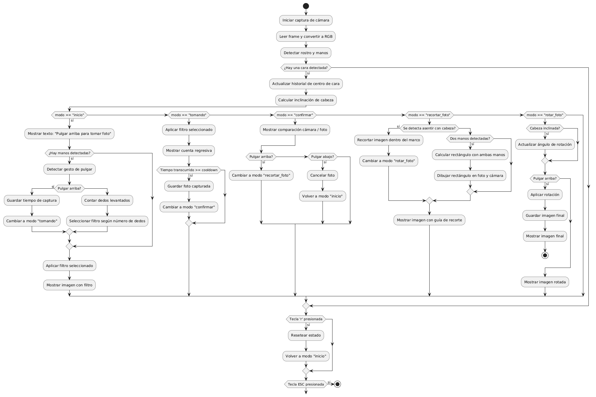

# Examen Final – Computación Visual
* **Estudiante:** Estphanie Pérez Mira
* **Número de documento:** 1013100405
* **Correo institucional:** eperezmi@unal.edu.co

## Problemática
En muchas situaciones cotidianas, especialmente en entornos como cocinas, laboratorios o áreas médicas, la interacción física con pantallas o dispositivos electrónicos puede ser poco práctica o incluso riesgosa desde el punto de vista higiénico. Por ejemplo, al tener las manos sucias o portar guantes contaminados, tocar un teléfono o computador puede comprometer la limpieza del entorno o del propio dispositivo. Este proyecto surge como una solución a ese problema, proponiendo un sistema de control de cámara y edición de imágenes basado en gestos detectados visualmente, eliminando la necesidad de contacto físico.

## Justificación de la solución
Desde la perspectiva de la computación visual, esta propuesta es relevante porque explora el uso de visión por computadora en aplicaciones prácticas que mejoran la interacción humano-máquina. Utilizando tecnologías como MediaPipe y OpenCV, el sistema reconoce gestos manuales para ejecutar comandos, lo cual representa un avance en interfaces naturales e intuitivas. Este enfoque no solo ofrece una alternativa funcional al tacto, sino que también abre posibilidades de accesibilidad y ergonomía en contextos donde la manipulación directa de dispositivos no es viable.

Además de facilitar la captura de imágenes sin contacto, integrar funciones básicas de edición fotográfica mediante gestos —como rotar, recortar o aplicar filtros— permite a los usuarios realizar ajustes rápidos sin interrumpir sus actividades ni comprometer la higiene del entorno. Esto resulta particularmente útil en situaciones donde se requiere documentar procesos o resultados visuales (por ejemplo, tomar fotos de una preparación culinaria o una muestra de laboratorio) y hacer modificaciones inmediatas sin necesidad de limpiar las manos o tocar pantallas. Al centralizar el control visual en una única interfaz gestual, se mejora la eficiencia, se reduce el riesgo de contaminación cruzada y se extiende el alcance de las aplicaciones de visión computacional hacia entornos donde la interacción sin contacto es fundamental.

## Talleres utilizados
### Taller - Gestos con Cámara Web: Control Visual con MediaPipe
[Enlace al enunciado en GitLab](https://gitlab.com/arbey.aragon1/visual_computing/-/blob/main/TALLERES/taller_gestos_webcam_mediapipe.md)

El corazón de la aplicación se basa en la detección de gestos manuales y movimientos de cabeza. Este taller fue fundamental para comprender cómo utilizar las métricas proporcionadas por MediaPipe, permitiendo implementar controles visuales basados en condiciones específicas. A través de esta práctica, se exploraron técnicas para interpretar distintos gestos y posturas, tales como:
* ¿Cuántos dedos están extendidos?
* ¿Está mostrando un gesto de pulgar arriba?
* ¿Ha inclinado la cabeza hacia la derecha?
* ¿Los dedos indice y pulgar de cada mano forman un rectángulo?

### Taller - Filtro Visual: Convoluciones Personalizadas
[Enlace al enunciado en GitLab](https://gitlab.com/arbey.aragon1/visual_computing/-/blob/main/TALLERES/taller_convoluciones_personalizadas.md)

La primera pantalla de la aplicación, que funciona como interfaz para capturar fotos, incluye una serie de filtros visuales aplicados en tiempo real a la imagen de la cámara. La implementación de estos efectos se basó en los conocimientos adquiridos durante este taller, en el que se trabajó con convoluciones 2D personalizadas aplicadas directamente sobre los píxeles de una imagen. Esta experiencia permitió entender cómo modificar visualmente una imagen utilizando máscaras y operaciones matriciales básicas.

Entre los efectos implementados se encuentran:
* **Filtro ASCII:** Representa la imagen usando caracteres.
* **Filtro Gameboy:** Reduce la paleta de colores y la resolución para simular una estética retro.
* **Filtro Edges:** Resalta los contornos de la imagen en blanco sobre un fondo negro.

### Taller - De Pixels a Coordenadas: Explorando la Imagen como Matriz
[Enlace al enunciado en GitLab](https://gitlab.com/arbey.aragon1/visual_computing/-/blob/main/TALLERES/taller_imagen_matriz_pixeles.md)
Dentro del enfoque de manipulación de píxeles, este taller fue clave para comprender cómo trabajar con los valores de color de una imagen accediendo a regiones específicas para modificarlas de manera precisa. Este conocimiento fue esencial para implementar la funcionalidad de recorte de imágenes en la aplicación, ya que permitió tratar la imagen como una matriz numérica y aplicar transformaciones localizadas.

En particular, este aprendizaje se aplicó en la pantalla de recorte de imágenes, donde:
* El área fuera del rectángulo de recorte fue diferenciada visualmente al convertirla a blanco y negro.
* Se extrajo la imagen recortada seleccionando únicamente el rango de filas y columnas correspondiente al área delimitada, tratándola como una submatriz de la imagen original.

### Taller - Rasterización desde Cero: Dibujando con Algoritmos Clásicos
[Enlace al enunciado en GitLab](https://gitlab.com/arbey.aragon1/visual_computing/-/blob/main/TALLERES/taller_algoritmos_rasterizacion_basica.md)
En este taller se implementaron algoritmos clásicos de rasterización para figuras geométricas, lo que permitió comprender cómo generar gráficos simples directamente a partir de cálculos matemáticos. Este conocimiento fue útil en la funcionalidad de recorte de imágenes de la aplicación, donde se necesitaba dibujar un rectángulo dinámico sobre la imagen capturada. Dicho rectángulo actuaba como guía visual para delimitar el área de recorte, ajustándose en tiempo real a medida que el usuario movía las manos para definir esa región.

### Taller - Transformaciones Básicas en Computación Visual
Este taller introdujo conceptos fundamentales de transformaciones geométricas, como la traslación, rotación y escala, aplicados a imágenes. Gracias a estos conocimientos, fue posible implementar de manera efectiva la funcionalidad de rotación en las imágenes capturadas dentro de la aplicación. El ángulo de rotación se determinaba dinámicamente a partir del movimiento de la cabeza hacia uno de los lados, permitiendo una interacción natural e intuitiva basada en gestos.

## Diagrama de actividades


## Evidencia de funcionamiento
### Cambiar filtros de cámara


### Tomar y recortar imagen


### Rotar y guardar imagen


## Video de sustentación
[Enlace al video en YouTube](https://youtu.be/YOWaI9TwldQ)

## Explicación técnica del funcionamiento
La aplicación se basa en un bucle principal que captura cuadros en tiempo real desde la cámara y los procesa utilizando las bibliotecas MediaPipe y OpenCV. En cada iteración, se detectan simultáneamente los puntos clave del rostro y las manos del usuario. A partir de esta información, se interpreta el estado del sistema según el valor de una variable llamada mode, que controla la lógica de transición entre diferentes fases del flujo: captura, confirmación, recorte, rotación y guardado de la imagen.

Durante la fase inicial (modo = "inicio"), el sistema espera gestos de la mano para activar distintas funcionalidades: un pulgar hacia arriba inicia la toma de una foto, mientras que levantar entre 1 y 4 dedos aplica filtros visuales en tiempo real sobre la cámara. Una vez tomada la fotografía, el usuario debe confirmar su selección con otro gesto de pulgar arriba, o volver al inicio con gesto de pulgar abajo. Luego de confirmar la foto, el proceso continúa con el recorte de la imagen, guiado por el reconocimiento de ambas manos formando un marco rectangular, y finaliza en una etapa de rotación, donde la inclinación de la cabeza determina el ángulo de giro. Todos estos controles se ejecutan sin contacto físico, permitiendo una interacción completamente visual mediante gestos y posturas faciales.

## Retos afrontados
Durante el desarrollo de esta aplicación, una de las principales dificultades técnicas fue la detección confiable de gestos específicos, especialmente el pulgar hacia arriba o hacia abajo. Estos gestos no solo implican identificar la orientación del pulgar, sino también asegurar que los demás dedos estén correctamente flexionados, lo que requiere un análisis más detallado de los puntos de referencia proporcionados por MediaPipe.

Otra complicación importante fue el manejo del cooldown entre gestos, necesario para evitar múltiples activaciones involuntarias. Coordinar este tiempo de espera sin interferir con la fluidez de la experiencia fue un desafío clave en la sincronización del sistema.

## Conclusiones y reflexiones personales
* A nivel técnico, el proyecto logró integrar exitosamente diversas técnicas de manipulación de píxeles con un rendimiento en tiempo real y sin lags perceptibles. Esto fue posible gracias al uso eficiente de operaciones matriciales y al procesamiento optimizado de imágenes con OpenCV.
* La experiencia demostró que es viable construir interfaces visuales intuitivas utilizando visión por computadora, y deja abierta la posibilidad de integrar estas soluciones dentro de contextos donde la accesibilidad y la higiene son fundamentales. 
* Personalmente, este proyecto me permitió reflexionar sobre el potencial de la visión computacional para ofrecer alternativas de interacción más inclusivas y naturales, sin contacto físico requerido.

## Getting started
Para poner en marcha el proyecto, sigue estos pasos para configurar el entorno virtual e instalar las dependencias necesarias:
### 1. Crear y activar el entorno virtual
Desde la carpeta raíz del proyecto, ejecuta el siguiente comando para crear el entorno:
```bash
py -3.10 -m venv mediapipe_env
```
Luego, activa el entorno con:
```bash
.\mediapipe_env\Scripts\activate
```
### 2. Instalar dependencias
Una vez activado el entorno, instala las librerías necesarias ejecutando:
```bash
pip install numpy==1.26.4
pip install mediapipe
pip install opencv-python
```
### 3. Ejecutar la aplicación
Para ejecutar la aplicación correctamente, no uses el botón de ejecución de VS Code. En su lugar, asegúrate de estar dentro del entorno virtual y ejecuta el archivo principal con:
```bash
python main.py
```